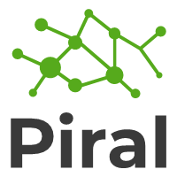

# [Piral](https://piral.io) &middot;       

Easily build a next generation portal application. Piral enables you to create a modular frontend application that is extended at runtime with decoupled modules called *pilets* leveraging a microfrontend architecture. A pilet can be developed independently and ships with the necessary JavaScript and bundled assets.

:zap: A pilet is capable of dynamically extending other pilets or using such extension slots itself. Otherwise, a pilet is quite isolated (developed and handled) and will never destroy your application.

## Getting Started

(tbd)

## Documentation

All the documentation is available [in the docs folder](./docs/README.md). Alternatively, look into our documentation website at [docs.piral.io](https://docs.piral.io).

## Contributing

The main purpose of this repository is to continue to evolve Piral core, making it faster, more powerful, and easier to use. Development of Piral happens in the open on GitHub, and we are grateful to the community for contributing bugfixes and improvements. Read below to learn how you can take part in improving Piral.

### [Code of Conduct](./CODE_OF_CONDUCT.md)

We adopted a Code of Conduct that we expect project participants to adhere to. Please read [the full text](./CODE_OF_CONDUCT.md) so that you can understand what actions will and will not be tolerated.

### [Contributing Guide](.github/CONTRIBUTING.md)

Read our [contributing guide](.github/CONTRIBUTING.md) to learn about our development process, how to propose bugfixes and improvements, and how to build and test your changes to Piral.

### Good First Issues

To help you get your feet wet and get you familiar with our contribution process, we have a list of [good first issues](https://github.com/smapiot/piral/labels/good%20first%20issue) that contain bugs which have a relatively limited scope. This is a great place to get started.

## License

Piral is released using the MIT license. For more information see the [license file](./LICENSE).
