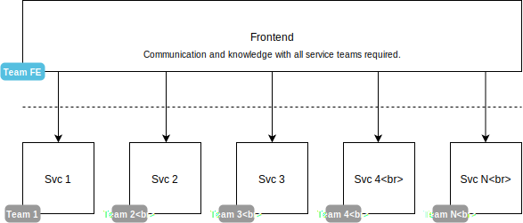

# Piral Architecture

Overall, Piral can be considered a cure for the common frontend monolith. The frontend monolith describes an architecture where the backend is nicely split into different modules (called services), but the frontend is communicating directly to all these services effectively aggregating the backend split into one giant codebase.

Piral allows you to lay out your application with a similar modularization approach. Instead of having to deal with one giant codebase, a Piral instance is usually just a very thin layer. This layer is what is primarily delivered to the end-user. The Piral instance is then responsible for gathering the (user-relevant) modules (called pilets) at runtime.

To make creating instances of Piral that effective the architecture of Piral needs to deliver. Let's start with the used building blocks.

## Building Blocks

Piral does not start from zero. The stack that is used by Piral is React-based. Nevertheless, the API supports any kind of framework, as long as it can work with an arbitrary element to render into.

Piral itself is based on **React** and its eco-system, e.g., **React DOM** (to render on a website), **React Router** (for routing), **React Atom** (global state management using `React.Context`) and **React Arbiter** (recalling modules at runtime).

As far as `piral` is concerned we take `piral-core` (main library without any backend or specialized API) and `piral-ext` (useful API extensions and backend connection) into account to become a single package.

To give any development another boost the Piral ecosystem also contains pre-made layouts and plugins. Any kind of layout plus any number of plugins may be used when creating your own Piral instance.

## Initial Loading

The initial loading of a Piral instance is a multi-stage process. Essentially, compared to a standard React / JavaScript app we inserted the middle three boxes, which render the Piral instance triggering the pilet loading and their eventual integration.

Note that while pilets can be loaded from cache as well, we usually require at least one communication with a server to ensure that the cached pilets are the ones that should be loaded for the user. Updates on the pilets, different feature flags and other factors may influence this decision.

## Pilet API

When pilets are setup they receive a special kind of object called the `Piral API`. The `Piral API` gives pilets access to the Piral instance in order to set up their components accordingly.

Setting up components may involve setting up dedicated (routes to) pages, tiles on a dashboard, general extensions, modal dialogs, and other components that need to be managed by the Piral instance.

For every `register*` API there is an `unregister*` API. All registrations can only be modified by their owners, i.e., if pilet A registered page A it cannot be unregistered by pilet B. The unregistration can be, however, performed at any time. Removing, e.g., a route will immediately remove it from the router. Thus if the page is currently shown we will instead of see the not found page.
