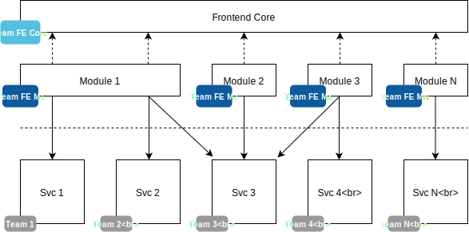
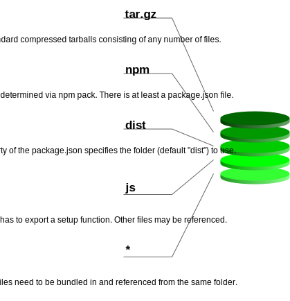
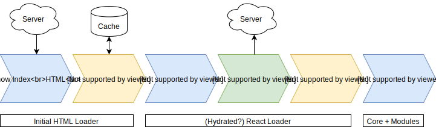

# Piral Architecture

Overall, Piral can be considered a cure for the common frontend monolith. The frontend monolith describes an architecture where the whole codebase of the frontend is a single repository, which has to be built in one step to produce something. No incremental rollouts, features, or distributed development approaches can be performed here.

Piral allows you to layout your application with modularization in mind. Instead of having to deal with one giant codebase, a Piral instance is usually just a very thin layer. This layer is what is primarily delivered to the end-user. The Piral instance is then responsible for gathering the (user-relevant) modules (called pilets) at runtime. These pilets can be developed in different repositories, e.g., owned by different teams.

To make creating instances of Piral effective, the architecture of Piral needs to deliver. Let's start with the used building blocks.

## Building Blocks

Piral does not start from zero. The stack that is used by Piral is React-based. Nevertheless, the API supports any kind of framework, as long as it can work with an arbitrary element to render it into.

Piral itself is based on **React** and its eco-system, e.g., **React DOM** (to render on a website), **React Router** (for routing), **Zustand** (global state container), and a React independent building block **Piral Base** (which allows loading modules at runtime via SystemJS).

As far as `piral` is concerned we take `piral-core` (main library without any backend or specialized API) and a set of standard plugins aggregated in `piral-ext` into account to become a single package. `piral` can be thought of as a framework, while the other building blocks are just ordinary libraries.

To give any development another boost the Piral ecosystem also contains pre-made layouts and plugins. Any kind of layout plus any number of plugins may be used when creating your own Piral instance.

A (technically speaking: inaccurate) analogy to illustrate what this means is that `piral-core` is like the Linux kernel. A certain distribution like Ubuntu would be `piral`. Additionally, to the kernel, there can be some special programs ("drivers"), which would be the Piral plugins. An application running in user space would then be a pilet. In this analogy, the role of `piral-base` would be a specific kernel driver, e.g., the TCP/IP driver.

A pilet is just an npm package containing a library. The library (JS file) is consumed by Piral, while the package is inspected and unpacked by a service (pilet feed service). The package contains some metadata, one or more JS files, and potentially some other assets.

The previous diagram shows the different layers contained in a pilet package. More information on the pilet format can be found in the specification.

## Initial Loading

The initial loading of a Piral instance is a multi-stage process. Essentially, compared to a standard React/JavaScript app we inserted the middle three boxes, which render the Piral instance triggering the pilet loading and their eventual integration.

Note that while pilets can be loaded from cache as well, we usually require at least one communication with a server to ensure that the cached pilets are the ones that should be loaded for the user. Updates on the pilets, different feature flags, and other factors may influence this decision.

## State Management

Piral comes with integrated state management focused around a created Piral instance.

The state management involves:

- bookkeeping of internally used components
- coordination/bookkeeping of components coming from pilets
- current application state (language, layout, ...)
- current search state (input, results, ...)
- keeping track of connected data feeds
- keeping track of input forms
- managing the current user (data)

You can extend and use state management in your Piral instance.

## Pilet API

When pilets are set up, they receive a special kind of object called the `Pilet API`. The `Pilet API` gives pilets access to the Piral instance to set up their components accordingly.

Setting up components may involve setting up dedicated (routes to) pages, tiles on a dashboard, general extensions, modal dialogs, and other components that need to be managed by the Piral instance.

For every `register*` API there should be an `unregister*` API (actually there *is*, but for some third-party plugins this might not be true even though we don't recommend this). All registrations can only be modified by their owners, i.e., if pilet A registered page A it cannot be unregistered by pilet B. The unregistration can be, however, performed at any time. Removing, e.g., a route will immediately remove it from the router. Thus if the page is currently shown we will instead see the not found page.

Besides the `register*` kind of APIs, there are also `show*` kind of APIs. These do not have a counterpart like `hide*`. Instead, these APIs return a disposer function to yield the power for closing them only to the openers and trusted friends (i.e., functions that received the disposer).

Finally, the last category of API calls is made up of the `create*` functions. These create a new kind of function that can be used to wrap existing components inside them. They should usually accept `AnyComponent` instances (i.e., independent of any framework), but could be also framework specific.
