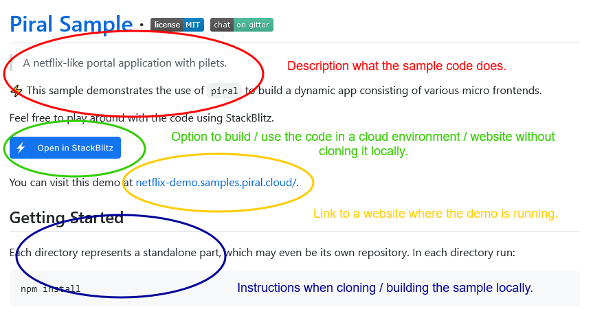

# All Demos, Examples, and Samples

We have a rich collection of different use cases, frameworks, tooling, and more online in a dedicated GitHub organization.

The GitHub organization includes (but is not limited to):

- [Netflix Demo](https://github.com/piral-samples/netflix-demo)
- [TODO MVC Demo](https://github.com/piral-samples/todo-demo)
- [Distributed Layout Sample](https://github.com/piral-samples/piral-distributed-layout)
- [Auth Usage Sample](https://github.com/piral-samples/piral-auth-sample)
- [Angular Lazy Loading](https://github.com/piral-samples/angular-lazy-loading)
- [Using Live Updates Sample](https://github.com/piral-samples/piral-live-updates)

Each repository has a README file that is shown directly. The READMEs look similar to the one below.

**Note**: Not every repository has a live website or can be opened in StackBlitz.

::: tip: Getting Started
The "getting started" section helps you to properly set up the repository after cloning it locally.
:::

If a desired sample is missing then just message use [on the community chat](https://gitter.im/piral-io/community).

## Links

- [Organization on GitHub](https://github.com/piral-samples)
