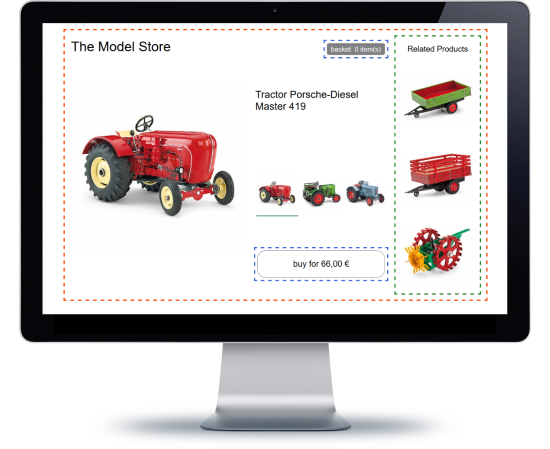

# Example: Pure Microfrontend Shop

An example app based on `piral`.

> A rebuild of the famous webshop example - all integrated in one repository.

## Description

The sample shows how simple a micro frontend app can be set up and created; especially if the app shell does not give any design. Pilets exchange components via extensions and everything just works.

The styling of the given application was inspired by the original demo. The code was written from scratch in React to illustrate how much simpler the code could look.

## Links

- [Demo Online](https://mife-demo.florian-rappl.de)
- [Code on GitHub](https://github.com/FlorianRappl/piral-microfrontend-demo)
