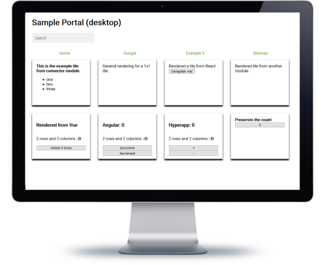

# Example: Only Core Library

An example app based on `piral-core`.

> Pilets are integrated for simplicity. The core pilet API is demonstrated.

## Description

The sample shows the essential use of piral-core with a very simple layout and a variety of (integrated) pilets that use most of the core pilet API functions. Some parts of the layout are fully customized by taking advantage of the available state container.

All backend interactions are mocked (e.g., via a `setTimeout`) to indicate only what Piral can do to sustain a good UX, for example by providing loading spinners.

The shown connectors display how simple an interactive data feed can be connected. Furthermore, the form examples illustrate the ease of making robust form handling with Piral.

## Links

- [Demo Online](https://demo-core.piral.io)
- [Code on GitHub](https://github.com/smapiot/piral/tree/master/src/samples/sample-piral-core)
