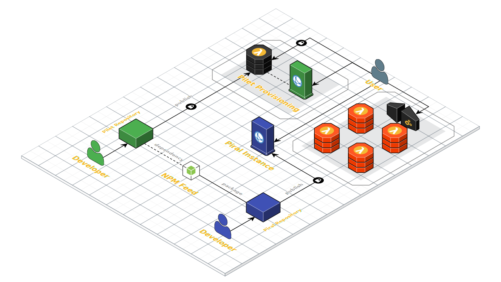

# Introduction

Piral is a solution for frontend modularization, where the different modules can be developed independently without any binding to the host system. We call these modules *pilets*. We therefore refer to a pilet as a small module that lives inside a piral instance. Piral gives you a set of tools for developing your application using [microfrontends](https://martinfowler.com/articles/micro-frontends.html).

While the idea of smaller (independent) modules is not new the provided approach has some advantages (and - depending on the use-case - disadvantages) over, e.g., bundle splitting as its done in modern build systems. Actually, the given approach is not exclusive and can be used together with bundle splitting.

A pilet is not only independent of the main application (a "Piral instance"), but also independently developed. This means we can give an independent development team the task to build a module in our application without requiring the same repository or infrastructure.

@[youtube](SkKvpBHy_5I)

The introduction video is available on [YouTube](https://youtu.be/SkKvpBHy_5I).

## Your First Piral Application

Piral offers us many choices to help us creating an outstanding portal-like application. There are, however, two main choices to get us off the ground:

1. Start with `piral` following only specifications and standard patterns
2. Implement everything on our own with help of `piral-core`

We will look at both ways. For simplicity, we start with 1. to have a working application in no time.

### Required Infrastructure

Hosting a Piral instance does not require much infrastructure. After all, a static storage (e.g., Amazon S3 or Azure Blob Storage) for the SPA is sufficient. For provisioning the pilets a dedicated service is required, which could be also set up as a AWS Lambda or Azure Function.

Your backend may be reached via some API gateway or directly. Let's see a diagram illustrating a sample infrastructure map.



For providing a great development experience your Piral instance also should be published to *some* NPM feed (which could be private). As a result different development teams can obtain the proper types and debug their pilets in a local Piral instance without much trouble.

### A Standard Piral Application

The main boost for implementing an application based on `piral` comes from the fact that `piral` can be considered a framework. All the choices are already made for us, e.g., how the application renders or which version of React is used.

Let's start with an empty folder / project somewhere:

```sh
mkdir my-piral && cd my-piral
npm init -y
```

Let's install `piral` (and we are done with the dependencies!):

```sh
npm i piral
```

This is it! Really? Well, we have not built, customized, or published this instance yet. Ideally, we use the `piral-cli` to do most of these tasks very efficiently without much configuration needs.

We should always add the CLI as a *local* **dev** dependency.

```sh
npm i piral-cli --save-dev
```

To help us see the commands in action we can also use a *global* version of the CLI. Make sure to have it installed via `npm i piral-cli -g`.

### A Piral-Core Based Application

Here, we will rely on `piral-core`, which can be considered a library. While very special dependencies such as `react-atom` are straight dependencies, common dependencies such as `react` are only peer referenced. This leaves many of the open choices up to the developer providing greater freedom.

## Piral Core vs Piral

The decision between `piral-core` and `piral` as the base package may not be simple. Our recommendation is to use `piral` when you are in doubt (or don't know what to do). If you have a very specific use case and want to customize the API for the pilets, as well as the communication with the backend as much as possible - then `piral-core` may be the right choice.

The following table compares the two from a out-of-the-box feature perspective.

| Feature             | Piral Core | Piral |
|---------------------|------------|-------|
| Breakpoints         | ️️️✔️        | ✔️    |
| Error Handling      | ️️️✔️        | ✔️    |
| Global State        | ️️️✔️        | ✔️    |
| Pages / Routing     | ️️️✔️        | ✔️    |
| Extension API       | ️️️✔️        | ✔️    |
| Shared Data API     | ️️️✔️        | ✔️    |
| Events API          | ️️️✔️        | ✔️    |
| Dashboard           | ️️️❌        | ✔️    |
| Language            | ️️️❌        | ✔️    |
| Connector API       | ️️️❌        | ✔️    |
| Notification API    | ️️️❌        | ✔️    |
| Modal Dialog API    | ️️️❌        | ✔️    |
| Menu API            | ️️️❌        | ✔️    |
| Polyfills           | ❌        | ✔️    |
| Translation API     | ❌        | ✔️    |

Both libraries are purely functional and do not provide any design. Thus the look and feel can be fully customized and designed in every aspect.

::: tip: Add Missing Features
A missing feature in `piral-core` can be also re-integrated by installing the respective plugin, e.g., `piral-dashboard` for providing dashboard capabilities.
:::
