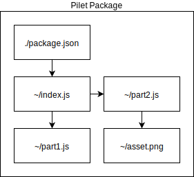

# Pilet Specification

## Abstract

A pilet is a small module that delivers additional functionality to a Piral instance. The exact format for packaging a pilet is described in this specification. The format is given by the layout and boundary conditions of the delivered package as well as parts of the package content.

## Introduction

A Piral instance alone only provides the shell for dynamically integrated modules called *pilets*. A pilet should be rather small and as atomic as possible. It could be bound to perform a certain task and / or to be delivered to certain users only.

At its core a pilet is just a JavaScript library that exports a single function which is used by a Piral instance. This allows the pilet to integrate the provided functionality when called by the Piral instance.

## Conformance

As well as sections marked as non-normative, all authoring guidelines, diagrams, examples, and notes in this specification are non-normative. Everything else in this specification is normative.

The key words *MAY*, *MUST*, *MUST NOT*, *OPTIONAL*, *SHOULD*, and *SHOULD NOT* are to be interpreted as described in [RFC2119](https://tools.ietf.org/html/rfc2119).

## Examples

(tbd)

## Glossary

**CDN**: Content Delivery Network

**IIFE**: Immediately Invoked Function Expression

**ISC**: Internet Systems Consortium

**JS**: JavaScript

**JSON**: JavaScript Object Notation

**MIT**: Massachusetts Institute of Technology

**NPM**: Node Package Manager

**UMD**: Universal Module Definition

**URL**: Uniform Resource Locator

**SPA**: Single Page Application

## Package Layout

The layout of a pilet package is a standard gzipped tarball (extension *tgz*) that matches the NPM package layout. In the root folder of the *tgz* file we also have the same `package.json` file. This file can - in addition to the standard NPM keys - contain special Piral related keys. The special keys are described in further details in the "Package Keys" section of this document.

The `main` key of the `package.json` has to point to a folder that has to contain all the assets shipped with the pilet. The assets must be linked from a JavaScript file that is either the *root JS file* or has been linked (directly or indirectly) by the *root JS file*. The *root JS file* is either directly named in the `main` key (e.g., `dist/example.js` would relate to the `dist` folder with *root JS file* `example.js`) or indirectly by just pointing to a folder (e.g., `dist/example` would relate to the `dist/example` folder with *root JS file* `index.js`).

The following diagram illustrates the potential contents of a pilet package. Important is that starting at the `package.json` all other references can be retrieved properly.



A pilet package may contain more file types than just JSON and JS. Any asset that can be referenced properly (e.g., images, videos, ...) can be added. The maximum file size of a pilet package is implementation dependent. Pilets that are larger than 16 MB are strongly discouraged. Services providing access to pilets only need to support pilets up to this size.

## JavaScript Bundling Considerations

The *root JS file* contains the root module, which is the first module loaded when the bundle is evaluated by a JS engine.

For proper bundling of the JS files the UMD specification should be followed. The following parts are all relevant for the created bundle.

1. Wrap the content of the bundle in an IIFE.
2. Define a module resolver (A) inside that uses a local `require` (B) as potential fallback. The local module resolver (B) will be passed in by Piral for the root module only.
3. If a global `require` (C) is given prefer this as fallback. Otherwise, define it in the end with the defined module resolver (A).
4. Work through the bundled modules using the module resolver (A) for resolving dependencies.

*Remark*: As global `require` (C) a `window.pr_...` function should be used that is generated (and valid) for the current bundle only.

The dynamic splitting of the single bundle into multiple files needs to adhere to the following algorithm.

1. Create a new `Promise` with `resolve` and `reject` handlers
2. Create a new `script` element
3. Set the `async` mode to `true`, the type to `text/javascript`, and the `charset` to `utf-8`
4. Set the `src` property to the script location
5. Attach the `reject` handler to the `onerror` event
6. Attach the `resolve` handler to the `onload` event
7. Append the `script` element to the `document.head`

The URL for the script has to be retrieved by the relative script URL combined with the root URL from the currently executing script. At the time of writing multiple ways exist to derive this root URL, each one with its own advantages and disadvantages.

The most robust way to derive the global script URL is by taking the a slice of the stack trace generated for an `Error` instance.

The following algorithm works quite reliably:

1. Start a new `try`-`catch` block
2. Inside the `try` block: throw a new `Error` object
3. Inside the `catch` block: Handle the `Error` by
   1. Getting the `stack`
   2. Matching the `string` against `(https?|file|ftp|chrome-extension|moz-extension):\/\/[^)\n]+` globally
   3. Obtaining the base URL from the match
   4. Otherwise just return `/`

The script for the partial resource has to be loaded from the same base URL as the currently running script.

## Package Keys

The following package keys are either already officially introduced by NPM and reused, or introduced only for usage in Piral.

### `name`

The `name` property is a standard NPM field that is required for a pilet.

The property defines the unique identifier of the pilet.

### `version`

The `version` property is a standard NPM field that is required for a pilet.

The property defines the unique version of the pilet. It needs to adhere to the semantic versioning specification.

### `description`

The `description` property is a standard NPM field that is optional for a pilet.

The property describes the contents and functionality of the given pilet.

By default the `description` is left blank.

### `author`

The `author` property is a standard NPM field that is optional for a pilet.

The property contains information about the author in form of a string or an object containing properties such as `name`, `email`, and `url`. The string's format can be either a simple string or an email string (format: `name <email>`).

By default the `author` is `(unknown)`.

### `license`

The `license` property is a standard NPM field that is optional for a pilet.

The property reflects the license used for distributing the given pilet.

By default the `license` is set to `ISC`, which is equivalent to MIT and NPM's default.

### `peerDependencies`

The `peerDependencies` property is a standard NPM field that is optional for a pilet.

The property contains information about the used shared dependencies that have to be supplied from the Piral instance. A feed service or Piral instance may reject the Pilet in case of unmatched shared dependencies.

By default the `peerDependencies` are set to an empty record `{}`, i.e., no peer dependencies.

### `dependencies`

The `dependencies` property is a standard NPM field that is optional for a pilet.

The property contains information about the used direct dependencies that are supplied by the pilet. A feed service or Piral instance may reject the Pilet in case of blacklisted or insecure  dependencies.

All direct dependencies should be split from the bundle to allow potential sharing with other pilets. In case of very small direct dependencies directly bundling them into the root module is acceptable.

By default the `dependencies` are set to an empty record `{}`, i.e., no dependencies.

### `main`

The `main` property is a standard NPM field that is optional for a pilet.

The field is used to help determine where the root module is located. It is strongly encouraged to *always* set this value to a path leading explicitly or implicitly to the root module.

By default the `main` is not set to an empty string.

The order of the search for the root module using the value of `main` (hereafter named `main`) is performed as follows:

1. Use `main` directly
2. Using `main` as a subpath below the `dist` directory
3. Using `main` as the path leading to an `index.js` file
4. Using `main` as a subpath below `dist` leading to an `index.js` file
5. Trying to find `index.js` in the root directory
6. Trying to find `index.js` in the `dist` directory

### `preview`

The `preview` property is a custom NPM field that is optional for a pilet.

The property contains a boolean value indicating whether the current pilet should be released as a preview independent of the information gathered from the semantic versioning.

This allows a pilet feed service to selectively increment preview versions of the same pilet. In case of a non-conflicting prerelease derived from semantic versioning the `preview` field wins.

By default the `preview`field is set to `false`.

## Root Module Layout

The root module must export a single function called `setup`. This function will receive a single argument known as the *pilet API*. The pilet API is the interface between the hosting Piral instance and a pilet.

The following TypeScript interface defines the expected exported shape of a pilet as seen from the perspective of a JS library.

```ts
interface RootModuleLayout {
  setup(api: PiletApi): void;
}
```

The provided pilet API must contain at least the following functionality.

(tbd)

## Limitations

Not all assets should be packed into a pilet. Videos and larger (or in general persistent) images should be hosted on a CDN, where data transfer is faster and caching is independent of the published version of the pilet.

The maximum specified file size of a pilet is 16 MB. Anything larger is potentially not supported by the used feed service.

(tbd)

## Acknowledgements

(tbd)

## References

* [RFC2119](https://tools.ietf.org/html/rfc2119)
* [NPM: About Packages and Modules](https://docs.npmjs.com/about-packages-and-modules)
* [UMD: Patterns and Examples](https://github.com/umdjs/umd)
