# Piral Inspector

## Introduction

[Piral Inspector](https://github.com/smapiot/piral-inspector) is a browser extension which streamlines your development process with Piral. It provides both deep insight unique to your Piral application and tools to debug it on the fly.

You can install the extension for the following browsers:

[{style="background-color: transparent"} **Firefox**](https://addons.mozilla.org/en-US/firefox/addon/piral-inspector) &nbsp; &middot; &nbsp;
[{style="background-color: transparent"} **Google Chrome**](https://chrome.google.com/webstore/detail/piral-inspector/ikbpelpjfgmplidagknaaegjhfigcbfl) &nbsp; &middot; &nbsp;
[{style="background-color: transparent"} **Microsoft Edge**](https://microsoftedge.microsoft.com/addons/detail/piral-inspector/hbdhpkhidilkmkbkklcbjgddbeodibml) &nbsp; &middot; &nbsp;
[{style="background-color: transparent"} **Opera**](https://addons.opera.com/en/extensions/details/piral-inspector)

## Piral Inspector In One Minute

::: tip: TL;DR
Piral Inspector only activates when you are _debugging a Piral application_ on _localhost_.
The new _toolbar entries_ in the browser show you when Piral Inspector can be used.
The actual features can all be accessed via the new _"Piral" tab_ in the browser's _developer tools_.
:::

Once installed, the Piral Inspector extension injects two new areas into your browser: A toolbar entry and a new panel in the browser's developer tools.

The toolbar entry indicates whether you can use Piral Inspector on the current page. If it looks like this, the current page is either _not using Piral_ or it is _not running on localhost_ - in either case, you **cannot** use the Piral Inspector extension here:

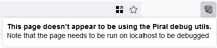

If the toolbar entry has a green icon and shows the following message, you **can** use the extension's debugging capabilities on the current page:

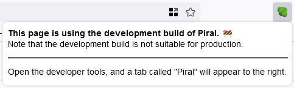

In that case, the new "Piral" tab in the browser's developer tools will display the heart of the Piral Inspector:

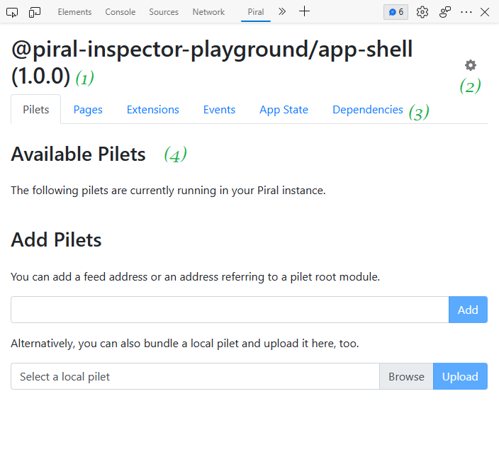

Here, ...
- **(1)** displays the application that you are debugging.
- **(2)** allows you to configure the extension. See [Settings](#settings) for details.
- **(3)** shows the feature tabs. Each tab holds a unique category of features. See [Features](#features) for details.
- **(4)** shows the current tab's content.

## Features

The extensions features are categorized via the tabs. Each tab hides a distinct set of related features. The following features are included and described in the upcoming sections:

- [Pilets](#pilets)
- [Pages](#pages)
- [Extensions](#extensions)
- [Events](#events)
- [Pilets](#pilets)
- [App State](#app-state)
- [Dependencies](#dependencies)

### Pilets

::: tip: TL;DR
The _Pilets_ tab allows you to view and modify the loaded pilets of your application. You can easily enable/disable pilets, as well as dynamically add new pilets either from a feed or from a locally built pilet bundle.
:::

When you are debugging an application which consists of multiple pilets, the Piral Inspector displays all those pilets and allows you to enable and disable them. This allows you to test and observe how the application behaves when pilets are present and missing. It is also possible to completely remove the pilet by pressing the ❌ button. In contrast to disabling a pilet via the toggle, a deleted pilet cannot be reenabled (in this session).

It is also possible to dynamically add new pilets which are not being debugged at the moment. There are two ways to do that. The first approach is to load the pilets from a feed address. This can be done by putting the feed's address into the textbox below and clicking "Add". The feed's pilets will then be loaded into the current application.

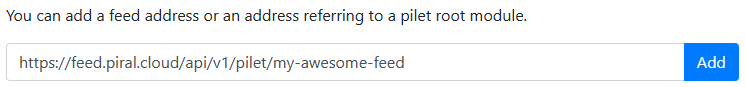

The second way is to directly upload a pilet. To do this, your pilet must be packed (e.g., via `pilet pack`). The produced bundle can be uploaded via the controls in the below image. Once uploaded, the pilet will be integrated to the current application.

::: warning: Temporary feed
The uploaded pilet will be loaded into a _temporary feed_ which will be _deleted_ after _60 minutes_.
:::

### Pages

::: tip: TL;DR
View all registered pages and quickly navigate to them with one click.
:::

The extension displays all registered routes in a table. This includes routes from both the app shell and from pilets. It is possible to easily make the application navigate to those pages by clicking on the respective route.

If the route requires one or more parameters, the extension will prompt you for those parameters. You can enter these as a JSON string.

### Extensions

::: tip: TL;DR
View all registered extensions and render them, standalone, on a new page.
:::

A Piral application typically consists of multiple extensions registered by various pilets. Extensions themselves need to be "plugged into" a page via dedicated components. Since the extensions are, very often, rendered in different pilets than where they are written, this can potentially make finding and testing them very hard. Piral Inspector tackles two problems in the "Extensions" tab:

1. Finding all registered extensions.
2. Allowing to quickly test an extension in isolation.

By default, the extension catalogue lists all registered extensions:

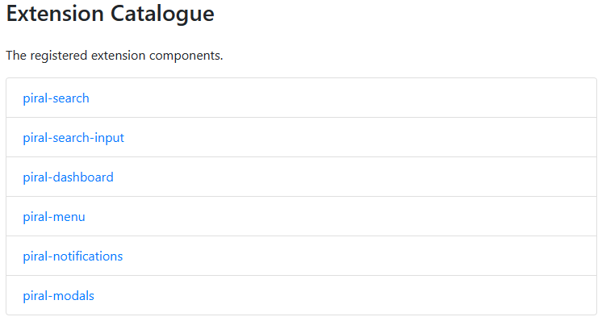

It is also possible to render an extension in isolation. To do so, click on the extension in the list, provide the parameters that the extension expects as a JSON string and click on "Render". The application will navigate to a new page which displays the extension (and only the extension), as it would in its "usual" location.

### Events

::: tip: TL;DR
View all events which have been emitted so far and manually publish events via the UI.
:::

Piral natively supports emitting and receiving events to loosely couple various components together. The Piral Inspector listens to all events emitted by a Piral application (once loaded) and displays these events in order, allowing to easily understand when the application emitted which event.

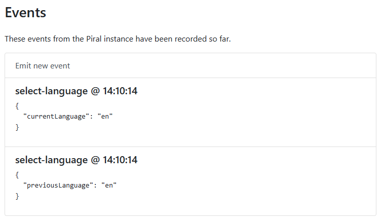

In addition, it is possible to manually publish events using the "Emit new event" button:

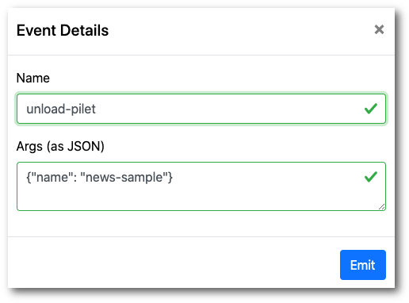

### App State

::: tip: TL;DR
View the app's global state.
:::

Each Piral application features a global state which, depending on the level of customization, defines large parts of the application's UI. Extensions and pages are, for example, registered within the global state. Viewing that state can become very important for debugging issues. Piral Inspector makes it possible to view the state in the "App State" tab. Here, you can navigate through the entire state tree, down to the very leaves.

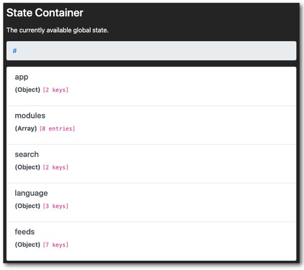

### Dependencies

::: tip: TL;DR
View a graph detailing the dependency and package structure of your application, including all pilets.
:::

Piral applications are inherently modular. A key feature of piral is dependency sharing, meaning that dependencies (i.e., packages) are not loaded multiple times, but just once, even if required by multiple pilets. This needs to be properly set up though.

Piral Inspector provides a feature which helps here: The "Dependencies" tab displays a graph of the application's dependency structure, from the app-shell to the pilets. In the following image, you can see the structure of a Piral sample application. The graph displays the app shell ("sample-piral", red), the pilets (gray) and the pilet's dependencies (purple). All pilets reference the same dependencies (`react`, for example), meaning that this dependency is properly shared between them.

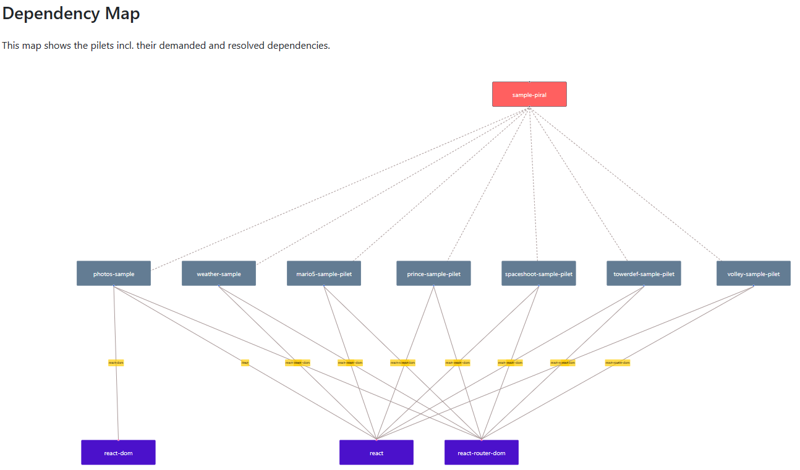

## Settings

::: tip: TL;DR
Both the extension and the debugged application can be configured to some degree. Some settings only work when debugging an _app shell_, while others only work when debugging _pilets_.
:::

Piral Inspector provides several settings, both for the extension itself and the debugged application. The settings have the following effects:

### State Container Logging

Enables/Disables the state container console logs which are, by default, emitted by Piral. You can disable this if your browser console feels cluttered.

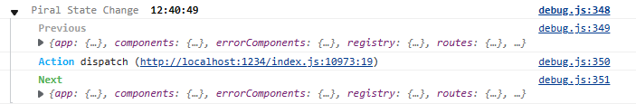

### Load Available Pilets

::: warning: Only for pilets
This feature only has an impact when debugging _pilets_, i.e., when `pilet debug` is running.
:::

Activates/Deactivates the loading of the available pilets.

### Full refresh on change

::: warning: Only for pilets
This feature only has an impact when debugging _pilets_, i.e., when `pilet debug` is running.
:::

Refreshes the current browser page when the currently debugged pilet changes.

### Visualize component origins

While enabled, provides an additional button that visually indicates the _origin_ of the page's components, i.e., the pilet where a component is registered. This can be very useful for analyzing Piral applications, e.g., for detecting which pilet needs to be updated when you want to make changes to a specific component.

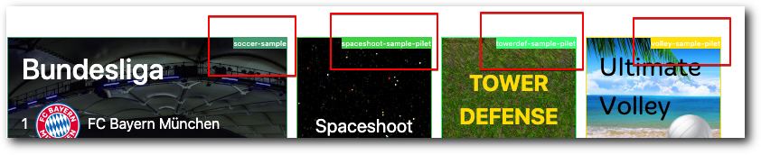

### Enable extension catalogue

Enables or disables the [extension catalogue](#extensions).

### Clear console during HMR

When enabled, clears the entire console when an HMT (Hot Module Replacement) is detected.

### Persist settings

When enabled, any changes made to these settings are stored. If disabled, any settings made are erased when the session expires.

### Switch to dark mode

Allows toggling the color mode of the extension panel.
