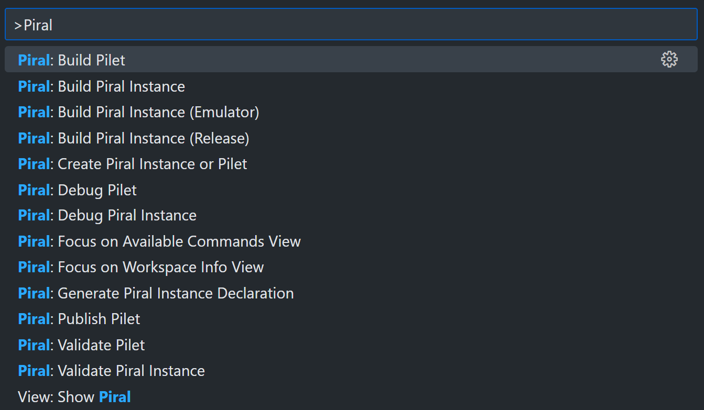
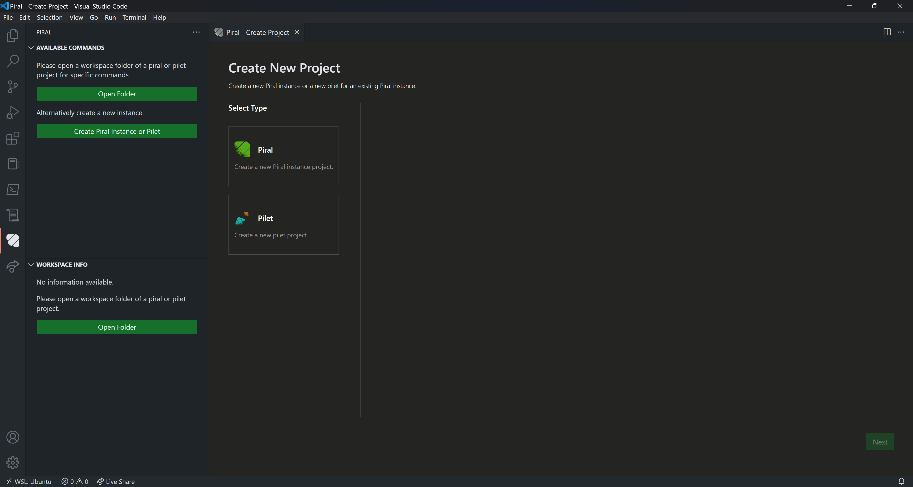
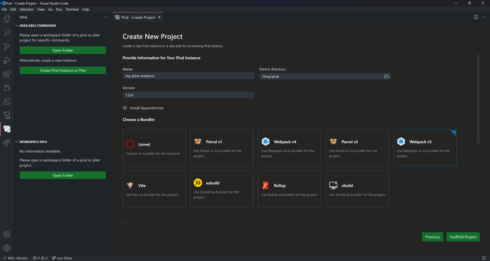
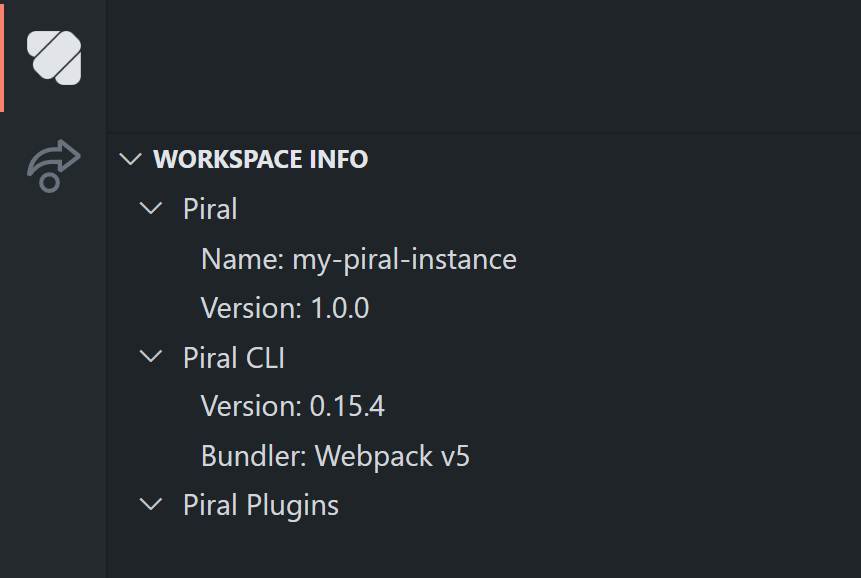
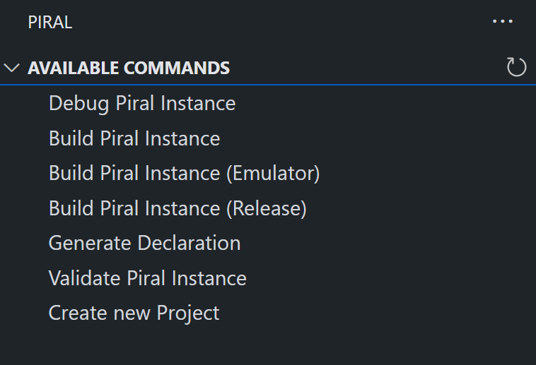

# Piral VS Code

## Introduction

[Piral VS Code](https://github.com/smapiot/vscode-piral) is an extension for [Visual Studio Code](https://code.visualstudio.com/). It provides many utilities for developing Piral applications, directly integrated into the editor.

You can install the extension from:

[{style="background-color: transparent"} **VS Code Marketplace**](https://marketplace.visualstudio.com/items?itemName=smapiot.vscode-piral) &nbsp; &middot; &nbsp;
[{style="background-color: transparent"} **Open VSX**](https://open-vsx.org/extension/smapiot/vscode-piral)

## Piral VS Code In One Minute

Once installed, the extension integrates itself in two (major) locations:

1. In VS Code's activity bar:  
   {height="300"}
2. In VS Code's command palette:  
   {height="300"}

The activity bar panel focuses on providing a GUI for typical day-to-day interactions when working with Piral, such as scaffolding projects or running CLI commands. The commands, on the other hand, can be used to quickly run Piral-related actions, such as building the project.

## Features

Overall, the extension provides the following features:

- [Scaffolding](#scaffolding)
- [Workspace Information](#workspace-information)
- [CLI UI](#cli-ui)
- [Documentation Integration](#documentation-integration)
- [`.codegen` File Support](#.codegen-file-support)

### Scaffolding

Piral VS Code provides a GUI for scaffolding new Piral projects, both for Piral Instances and pilets. The scaffolding process is a layer on top of the Piral CLI - it shows the options that the Piral CLI supports with the help of a user-friendly UI.

To scaffold a new project, VS Code must be opened in a non-Piral workspace. You are then presented with the option to "Create [a] Piral Instance or Pilet":

When clicked, a scaffolding window opens. While it might look slightly different between Piral Instances and pilets, it will look similar to this:

Simply fill in your desired project properties and click on "Scaffold Project" to see your project being setup automatically.

### Workspace Information

When working on a Piral project, VS Code gives you an overview about the Piral-specific project information. This can be useful to understand the entire setup, especially when new to a project, or when troubleshooting issues.

{height="250"}

### CLI UI

When working with Piral, you typically use the Piral CLI to debug/build/pack/... the various projects. In addition to using the terminal or package manager scripts, the VS Code extension provides a GUI for running the common commands with the click of a mouse button:

{height="250"}

All of these commands can also quickly be run via the command palette.

### `.codegen` File Support

When working with the Piral ecosystem, you might already have encountered `.codegen` files. These are, as the name suggest, used for code generation and are, essentially, plain JavaScript files. By default, VS Code doesn't have inbuilt support for that file extension. Piral VS Code changes that:

{height="250"}
