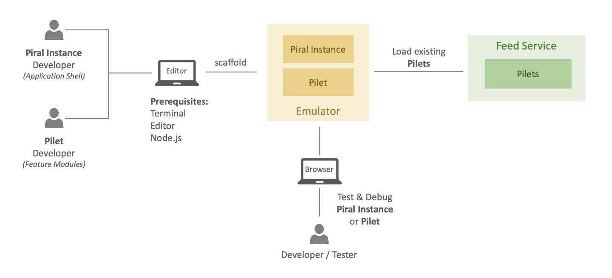

# Introduction

Many modern backend system landscapes follow the architecture pattern of **microservices**, while the frontends are still mostly implemented as single applications, which integrate with the entire backend as a kind of monolithic solution. The **Piral** ecosystem offers the framework for building **microfrontend** solutions, which allows the creation of distributed web application reflecting the flexibility and modularized structure of a microservice backend.

We also have a quick introduction of Piral available in form of a video.

@[youtube](https://youtu.be/ltTXWEwhSiY)

The following tutorials will start with guidance for the first steps through to advanced topics for working with the Piral framework.

The diagram above illustrates the setup and process for developing with Piral. The prerequisites are fairly minimal and as developer you only need your favorite editor, a terminal, an Internet browser and Node.js installed. The **Piral instance** (application shell) and the **pilets** (feature modules) can be executed and debugged in the emulator on the local development machine.

A **Piral instance** (application shell)

- brings the overall *design* of the application (e.g., header, footer, navigation, ...)
- includes *shared components* that can be used by pilets
- defines how pilets are loaded and *where pilets can integrate* their components

On the other side, the **pilets** (feature modules)

- brings the *content* for the application (e.g., functionality, queries and mutations, ...)
- include *their own* assets and dedicated dependencies
- define *where they want to integrate* their components into (as given by the Piral instance)

When the pilets have reached a certain maturity level, a developer can publish them into the **Pilet Feed Service**. Via the Feed Service available modules can be loaded into the local development environment so that developers and testers can validate how their new module integrates with other pilets.

Let's get started with the first tutorial and enter the world of Piral!
