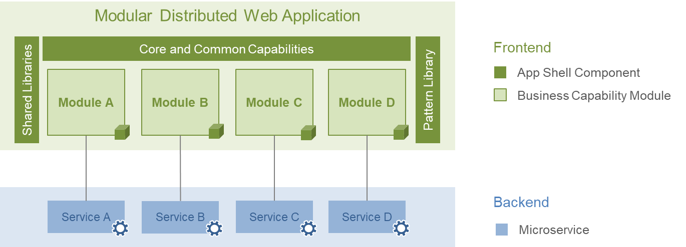
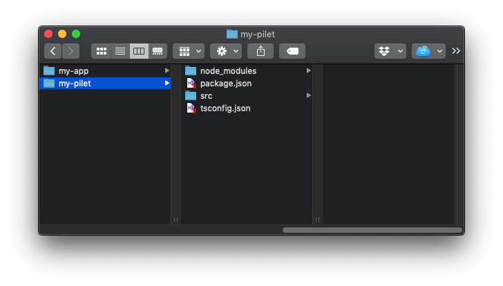

# Getting Started

This tutorial will guide us through the steps on how to create our first pilet, which is executed within a basic application shell based on a Piral instance.

This quick start will show us how to

1. Install the **tooling** for working with Piral
2. Setup an **application shell** based on Piral
3. Create your first **pilet** with some basic functions

## Video

We also have a video tutorial:

@[youtube](https://youtu.be/jHmzE1j64zo)

## Prerequisites

For completing the tutorials, the following general prerequisites must be met:

- **node.js** must be installed at least in version v8. We recommend version v10 or later. The installed version can be checked with the command `node --version`. Please visit https://nodejs.org for details regarding the node.js installation.

## Setting up the Tooling

Piral comes with a powerful command-line tool named `piral-cli`. The `piral-cli` supports developers in executing the most important tasks and can be installed with the following command:

```sh
# Install the Piral CLI
npm i piral-cli -g

# Check version of the Piral CLI
piral --version
```

::: warning: Be cautious with global tools
Installing utilities globally may be harmful. It is recommended to avoid doing that. If you don't want to install the `piral-cli` package globally then this is fine, too. The whole tutorial works without doing so - just follow the tips below for code snippets that use the global installation.

Usually local versions of the `piral-cli` (here the commands start with `npx` such as `npx piral` or `npx pilet`) are used.
:::

For executing this tutorial, the `piral-cli` in version 0.14.0 or later is required. To get help for the available commands, run `piral --help`.

## Create an Application Shell (Piral Instance)

A Piral instance builds the application shell and as such the foundation for executing pilets. All central and shared functions like layout, navigation menus, or notification handling will be configured in the Piral instance.

In the end, the app shell is the foundation for the whole frontend. In the diagram below we see that the app shell is the top layer, which may (later on) hold other shared libraries or the shared UI components. The modules are then built later.

{.auto}

So let's set up a new Piral instance to get our app shell running!

### Setup a new Piral Instance

A Piral instance can be created using `piral-cli`. To scaffold a new application shell based on Piral with the name `my-app` execute the following command in a terminal window:

```sh
# Scaffold an application shell
piral new --target my-app
```

As a result, we will find in the folder `./my-app` the files for the newly created application shell.

::: tip: Use npm initializers
In case you don't want to install the Piral CLI globally, you can also leverage the npm initializer for this command.

In **npm v6** you can write:

```sh
npm init piral-instance --target my-app --defaults
```

In **npm v7**, **npm v8**, and higher you'd write:

```sh
npm init piral-instance -- --target my-app --defaults
```

The npm initializer comes with a quick survey going over the options. Specifying `--defaults` will take the default values.
:::

### Run the Application Shell

To execute the created Piral instance, navigate to the directory `my-app` and run the following `piral-cli` command:

```sh
# Start the Piral instance in debug mode
npx piral debug
```

The `npx` task runner is used to force using the local version of the `piral-cli`. This works in cases where you installed the Piral CLI globally, but also works if you preferred to use the npm initializer. The latter is our recommendation.

<!-- markdown-link-check-disable-next-line -->
When the build process is completed, the application shell can be opened locally in a browser. The output of the debug process shows the local address, which is usually http://localhost:1234.

If you need to change the port, on which the instance is exposed, you can select a custom port just by adding the flag `--port <port_number>` to the `piral-cli` command.

At this point, the application shell shows an empty page, since there is currently no layout defined and no pilet loaded into the application shell. In the next section, we will create a pilet and load it into the new application shell.

### Create Package for the Application Shell

To use the newly created Piral instance as the application shell (or simply "app shell") for the development of pilets, we need to create an **npm package**, which will be referenced within pilets. To create the package run the command:

```sh
# Create an npm package for the app shell
npx piral build
```

This will trigger the build of a Piral instance. By default, this command will create two folders within the `dist` folder: `emulator` and `release`. The latter contains the files for publishing the app shell to some host later on. The former contains an *emulator package*.

::: tip: Only build the emulator
The previously used command builds both `release` and `emulator`. If you only want, e.g., the emulator package you can use the `--type` flag:

```sh
npx piral build --type emulator
```

:::

The *emulator package* is a tarball containing the application shell, in our case, it will be named `my-app-1.0.0.tgz`. Usually, the tarball will be published to a (private) npm registry, so that all development teams will be able to reference and use the same Piral instance for developing their pilets.

{.auto}

For local development (or this tutorial) we can refer to the Piral instance locally.

## Create Pilet using the Piral CLI

A pilet is a module, which implements functionality and can be loaded dynamically into an application shell based on Piral.

### Create Pilet

The Piral tooling also supports scaffolding a pilet to get started. Ensure that you are no longer in the directory of the application shell and run the following command:

```sh
# Scaffold a new pilet with the name 'my-pilet' for the app shell 'my-app'
# For the path to the tgz we assume the following path, make sure to adapt it to your directory structure
pilet new ./my-app/dist/emulator/my-app-1.0.0.tgz --target my-pilet
```

With the `pilet new` command, a new pilet with pre-defined content is created. The first parameter `./my-app/dist/emulator/my-app-1.0.0.tgz` specifies the application shell, which the pilet will be built for. Make sure that you adjust the path to the Piral instance located in your local directory structure.

{.auto}

If you navigate into the folder `my-pilet`, you'll find the files for the newly created pilet.

::: tip: Use npm initializers
You can also leverage the npm initializers for creating new pilets.

In **npm v6** you can write:

```sh
npm init pilet --target my-pilet --source ./my-app/dist/emulator/my-app-1.0.0.tgz --defaults
```

In **npm v7**, **npm v8**, and higher you'd write:

```sh
npm init pilet -- --target my-pilet --source ./my-app/dist/emulator/my-app-1.0.0.tgz --defaults
```

Also here, if you drop the `--defaults` option additional settings will be presented to you in form of a quick survey.
:::

### Pilet Setup Function

There is a single function, which controls the configuration of a pilet - it is the `setup` method in the file `./src/index.tsx`. The scaffolding process will add the setup function with some configurations:

```jsx
export function setup(app: PiletApi) {
  app.showNotification('Hello from Piral!');
  app.registerMenu(() =>
    <a href="https://docs.piral.io" target="_blank">Documentation</a>);
  app.registerTile(() => <div>Welcome to Piral!</div>, {
    initialColumns: 2,
    initialRows: 1,
  });
}
```

The `PiletApi` provides a series of useful methods for setting up and configuring a pilet. For example, the scaffolding registers with the method `registerTile` a tile for the dashboard and a menu entry with the method `registerMenu`. Subsequent tutorials will guide us through the usage of the most important `PiletApi` methods.

### Start the Pilet

As for the application shell, the pilet can be started in debug mode using the `piral-cli`. In the pilet folder, in our case `my-pilet`, execute the following command:

```sh
# Start a Pilet in debug mode
npx pilet debug
```

When navigating to `http://localhost:1234`, the application shell will be started and the content of the pilet will be shown. Currently, a tile with "Welcome to Piral!" is shown on the dashboard with a link to the "Documentation" in the top navigation, and a short-lived notification "Hello from Piral!" appears on the bottom right corner.

**Remark:** Although our pilet has already the setup for a menu entry and showing a notification, those entities are not visible when starting the pilet. The reason for this is that for our current version of the application shell no menu and no support for notifications have been configured yet. Subsequent tutorials will guide us through configuring further functions of the application shell.

## Next Steps

In this getting started tutorial, you have

- Created an **Application Shell** based on Piral using the command-line tool, which comes with Piral
- Created a basic **pilet**, which is executed in the previously created application shell

The next tutorial will describe how to upload a pilet to the community version of the **Piral Feed Service**.
