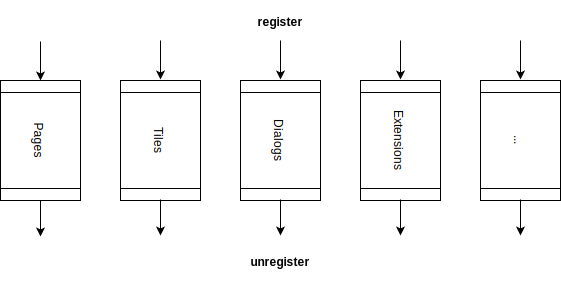
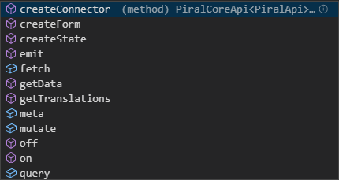

# The Pilet API

So far we almost exclusively used existing elements without deeply understanding or touching them. Now it's time to see how pilet development may look in reality and how we can - from a pilet - bring in all the functionality to the application shell we want or need.

## Video

We also have this tutorial available in form of a video.

@[youtube](https://youtu.be/s8dYsd7eQPc)

## The Pilet Foundation

As described earlier a pilet is just a library compiled as an UMD module that exposes a function called `setup`. The `setup` function receives a special object that we like to call the *pilet API*. It is the API *created specifically for the pilet*. This allows the pilet to bring in new functionality to the application shell (called Piral instance).

The application shell determines how the pilet API looks like. In Piral we already determine some common parts for the pilet API - things like an API to register pages, dashboard tiles, or modal dialogs. Furthermore, some convenience functions may also be included in the pilet API. For instance, in Piral we've added functions for handling the pilet's global state.

Most APIs will be designed in a symmetric way, i.e., such that one call has a respective counter-part. An example is the "register" class of available API calls.



For every register method (e.g., to register a page) there is an unregister method. Usually, we will only require to use the register method, however, in special cases we may want to dynamically add (and then remove) some functionality.

## The Provided API

As already mentioned the provided API is determined by the underlying application shell. Therefore, we cannot discuss the full API that may be available to a specific pilet. However, what we can do is to explain the API created by Piral - as it will be fully available in most pilets.



Note that the API will also be passed on to all registered components as a prop named `piral`.

The API contains functionality to be placed in the following categories:

- Application shell components (tiles, pages, ...)
- Sharing functionality with other pilets (extensions, data, events ...)
- Reflecting capabilities (meta, ....)
- Helpers and common functionality (state, ...)

While some functionality definitely needs to be used (e.g., `registerPage` for showing a page) other functionality is rather optional and may be skipped (or even disabled by the application shell) on purpose.

**Remark:** The architecture of what functionality goes into which pilet, as well as what to be used (and where) of the pilet API is completely in your hands. Our recommendation is to make pilets as simple and lightweight as possible. Furthermore, we recommend using the pilet API only on few places, such that most of your code would actually be "Piral independent".

## Adding a Page

While the pilet API gives us a powerful and flexible way to describe what to do with our pilet, it also leads to complexity. Alternatively, we could think of describing what pages (or components in general) to use in the *package.json*. While such a method may have some advantages, it will always miss the flexibility that we gain by using code to perform the registration.

Assuming we create a new pilet for the previously created application shell `my-app` we would end up with the following root module:

```ts
import { PiletApi } from 'my-app';
import { MyPage } from './MyPage';

export function setup(app: PiletApi) {
  app.registerPage('/my-page', MyPage);
}
```

The `MyPage` component is exported from a new file called *MyPage.tsx*. It can be as simple as:

```jsx
import * as React from 'react';

export const MyPage: React.FC = () => (
  <div>
    <h1>Hello!</h1>
    <p>This the content from the new page.</p>
  </div>
);
```

Running this code will not result in anything fancy. We can now go to http://localhost:1234/my-page for seeing the page. On the landing page (dashboard) or in the menu we do not see any entry. We may want to link the page somehow.

## Linking the Page

There are multiple options on how to link the page. We could leave the page as-is, such that any other pilet would need to use (or know) the link to it. If we want to expose the page as a link in the menu we need to register such a menu entry.

The `setup` could thus change to look as follows:

```ts
import { PiletApi } from 'my-app';
import { MyPage } from './MyPage';
import { MyPageMenu } from './MyPageMenu';

export function setup(app: PiletApi) {
  app.registerMenu(MyPageMenu);
  app.registerPage('/my-page', MyPage);
}
```

The component is imported again from another module - this time the module is the file *MyPageMenu.tsx*.

```jsx
import * as React from 'react';
import { Link } from 'react-router-dom';

export const MyPageMenu: React.FC = () => (
  <Link to="/my-page">My Page</Link>
);
```

We just use the standard `Link` from `react-router-dom`. There is no additional knowledge about Piral at all here. This is a general tendency in Piral - we always want to look for standard ways first as they are known already and much easier to transport than new knowledge.

Additionally, its easier to use existing code or share this component with existing code.

But normally our components (e.g., pages) will not stay so simple, right?

## What about Data

Modern web applications are a combination of static assets (text, images, ...) with dynamic data (usually coming from an API). These are not your daddy's websites anymore - they are live and closer to normal applications in every metric.

In Piral we wanted to make sure that data access is particularly simple. Obviously, our approach is not for everyone and so its neither mandatory nor exclusive - you can actually use whatever you prefer.

Pilets have access to an auxiliary API called `createConnector`. This will create a data connector, which is a React higher-order component (HOC). A higher-order component can be used to wrap an existing component to give it additional functionality - in this case access to some target data.

Let's see a simple example. We will now modify our page to include some posts received from an API:

```jsx
import * as React from 'react';

export interface MyPageProps {
  data: Array<{
    id: number;
    userId: number;
    title: string;
    body: string;
  }>;
}

export const MyPage: React.FC<MyPageProps> = ({ data }) => (
  <div>
    <h1>Posts</h1>
    <ul>
      {data.map(item => (
        <li key={item.id}>
          <b>{item.title}</b>
          <p>{item.body}</p>
        </li>
      ))}
    </ul>
  </div>
);
```

The only thing we did so far is describing how *the data should be presented*. The component should have nothing to do with *how to retrieve the data*.

Obviously, we could introduce some functionality and separate it, but this is something that was already done in Piral. We can use `createConnector` in the `setup` function to get this smoothly.

```ts
import { PiletApi } from 'my-app';
import { MyPage } from './MyPage';
import { MyPageMenu } from './MyPageMenu';

const apiUrl = 'https://jsonplaceholder.typicode.com/posts';

export function setup(app: PiletApi) {
  const connect = app.createConnector(() => fetch(apiUrl).then(res => res.json()));
  app.registerMenu(MyPageMenu);
  app.registerPage('/my-page', connect(MyPage));
}
```

The `connect` HOC can be used multiple times. It will lazy load[^1] the data. When the data has been loaded already the available data will be shown. Otherwise, a loading screen will display. This is a simple way to have the full data lifecycle covered in React without needing to spend any time implementing it.

Next we will see how to customize the Pilet API from the Piral instance.

[^1]: Lazy loading means that whenever the component is first mounted the connector will call the given connector function.
