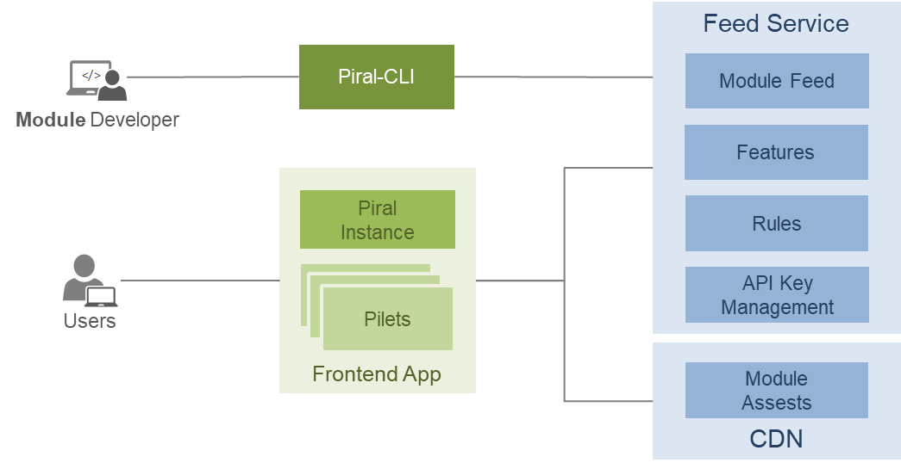

# The Piral CLI

The Piral CLI is a Node.js based command line tool that can be used to automate everything around a Piral instance, as well as around pilets.

It is easy to customize and comes with batteries included. The Piral CLI comes with three different shell executables - a generic `pb` script ("Piral build"), `piral` for Piral instances, and `pilet` for pilets. Each executable holds a variety of commands which are passed in as the first argument.

```sh
pb [any-command]
piral [piral-command]
pilet [pilet-command]
```

Here, `any-command` is the union of all `piral-command` (suffixed with `-piral`) and all `pilet-command` (suffixed with `-pilet`) instructions. Additionally, some commands that that belong to neither category may be found here.

## Video

We also have this tutorial available in form of a video.

@[youtube](https://youtu.be/Uk5t49f4o2A)

## Responsibilities

Before we continue, let's recap why the Piral CLI has been introduced in the first place. The following diagram shows the place of the Piral CLI in the Piral ecosystem.



Initially, the Piral CLI helps to

- create a new Piral instance, and
- scaffold a new pilet for a specific Piral instance.

The Piral CLI should be used for:

- debugging (i.e., developing), building, and publishing the Piral instance
- debugging (i.e., developing), building, and publishing a pilet

It also can be used to

- simplify standard tasks,
- check the validity of the Piral instance, and
- validate pilets to follow certain standards.

Since the Piral CLI is extensible it provides all capabilities necessary to follow self-defined standards, e.g., to validate certain edge cases or industry-specific legal constraints.

## Local vs Global

To simplify development a global installation of the Piral CLI makes sense. Nevertheless, we've made sure that global installation are unnecessary and less important by introducing a couple of important factors.

### NPM Initializers

We created prompt-focused tools in form of NPM initializers. Instead of creating a new Piral instance via

```sh
piral new my-app
```

you can use the NPM initializer `create-piral-instance`:

```sh
npm init piral-instance
```

The same is possible for scaffolding pilets. Instead of using

```
pilet new my-app --target my-pilet
```

you can use the NPM initializer `create-pilet`:

```sh
npm init pilet
```

While the Piral CLI commands use command line arguments to determine the behavior, the NPM initializers provide an interactive version at the command prompt to fill out the parameters.

### Local First

When you are within an NPM project folder structure and run a Piral CLI the local Piral CLI instance (if available) is taken. Right now there is no way to override this.

As far as Piral CLI plugins go, their integration is *always* a combination of the local ones found (preferred) plus the global ones available. There is no option to deactivate global plugins.

Local installations should always be considered. First, this makes behavior (e.g., builds) reproducible. Second, this ensures that everyone who checks out the source has all the tools to use it.

## Extending the Piral CLI

We already mentioned the use of plugins for the Piral CLI. A plugin for the Piral CLI is just another NPM package which has a name starting with `piral-cli-`, e.g., `piral-cli-my-plugin`.

A Piral CLI plugin package exports a single function.

```js
module.exports = function (cliApi) {
  // your code
};
```

This function receives the Piral CLI API (`cliApi`). With the CLI API we can do things such as wrapping commands or adding new commands. For commands the yargs[^1] command definition is followed.

[^1]: Yargs is a popular [Node.js library](https://yargs.js.org/docs/) for parsing command line arguments.

An example command:

```js
module.exports = function (cliApi) {
  cliApi.withCommand({
    name: 'dependencies-pilet',
    alias: ['deps-pilet'],
    description: 'Lists the dependencies of the current pilet.',
    arguments: [],
    flags(argv) {
      return argv
        .boolean('only-shared')
        .describe('only-shared', 'Only outputs the declared shared dependencies.')
        .default('only-shared', false)
        .string('base')
        .default('base', process.cwd())
        .describe('base', 'Sets the base directory. By default the current directory is used.');
    },
    run(args) {
      // your code here, where args.onlyShared refers to our custom argument
    },
  });
};
```

Since this command is suffixed with `-pilet` it will be available on `pb` (e.g., `pb dependencies-pilet`) and `pilet` (e.g., `pilet dependencies`).

Besides `withCommand` we also see other possibilities. One option is to add custom validation rules using `withPiralRule` or `withPiletRule`. We'll explore this option later.

## Validations

Piral validations are helpful to assert that the Piral CLI can work properly with the current Piral instance. While pilet validations share a similar goal, they tend to be much more domain specific.

As such, currently all (included) Piral validations have no options and are always active. In contrast, most pilet validations are by default in a more conservative mode - only spitting out suggestions as warnings or not running at all.

Running the validations is simple.

```sh
# Validate the current Piral instance
piral validate
# Validate the current pilet
pilet validate
```

Extending the set of available rules with a plugin is simple. For example, the `withPiletRule` can be used to add another rule for the validation of pilets.

```js
module.exports = function (cliApi) {
  cliApi.withPiletRule('no-dependencies-with-a', (context, options = 'ignore') => {
    if (options !== 'ignore') {
      const dependencies = Object
        .keys(context.dependencies)
        .some(m => m.startsWith('a'));

      if (dependencies.length > 0) {
        context.error(
          `
The pilet references dependencies starting with "a".
  Expected: <none>.
  Received: "${dependencies.join('", "')}".
`,
        );
      }
    }
  });
};
```

In the example above the new rule `no-dependencies-with-a` would be ignored by default. This is a great default value for the validation of a pilet.

The validation configuration of pilets is fully determined by the respective Piral instance. It will use the `validators` section of the `pilets` info. Repeating the same default for the rule above would look as follows (snippet):

```json
{
  "pilets": {
    "validators": {
      "no-dependencies-with-a": "ignore"
    }
  }
}
```

Of course, if we want to use this particular rule we should give it a different value.

```json
{
  "pilets": {
    "validators": {
      "no-dependencies-with-a": "active"
    }
  }
}
```

The incoming option value should be checked. In case of an unknown value a warning should to be emitted. In such cases the default value should be the fallback.

**Remark**: The Piral CLI does not check if all listed validators really exist. Instead, only the ones that exist will be called.

## Next Steps

In this tutorial we looked at the Piral CLI in more detail. Now that we know the areas where the Piral CLI helps us greatly we can make use of it more efficiently.

The next part of our tutorial series deals with best practices for writing pilets.
