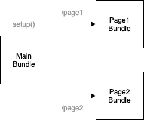
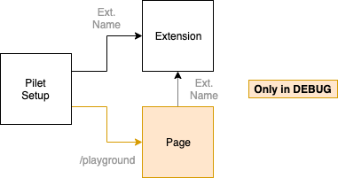

# Pilet Best Practices

In general a pilet should be treated like a normal application, i.e., a sound architecture should be designed and followed. A core difference between a pilet and a normal application is the root module, which exports the `setup` function. The `setup` function receives the Pilet API and wires the components defined in the pilet together in such a way that they make sense from the app shell's perspective.

Piral has been designed in such a way that its up to the user to decide how deep Piral should be integrated (or visible) in pilets. Our recommendation is to keep the connection shallow, i.e., to only reference Piral in the root module. Let's investigate some patterns we may want to follow.

## Separate Data from Views

Piral wants to help you to separate your data handling from your actual views. Using Piral's `createConnector` HOC you can separate the two easily.

Before a clean separation:

```jsx
// root module: index.tsx
export function setup(app: PiletApi) {
  app.registerPage('/my-page', Page);
}

// page module: Page.tsx
export const Page: React.FC = () => {
  const data = useFetchHook('https://my-api.com');
  return (
    <div>
      Sample display
    </div>
  );
};
```

After using the `createConnector` HOC with a separate module:

```jsx
// root module: index.tsx
export function setup(app: PiletApi) {
  const connect = createConnector(fetchData);
  app.registerPage('/my-page', connect(Page));
}

// api module: api.ts
const apiUrl = 'https://my-api.com';

export function fetchData(): Promise<MyData> {
  return fetch(apiUrl).then(res => res.json());
}

// page module: Page.tsx
export const Page: React.FC<{ data: MyData }> = ({ data }) => (
  <div>
    Sample display
  </div>
);
```

The created connector can be used for multiple components. It will lazy load the data and persist the received content.

Quite often, a simple data fetcher is not enough. In this case we may want to work with additional sections. Let's say we also need to create a WebSocket.

The transformed code now looks as follows:

```jsx
// root module: index.tsx
export function setup(app: PiletApi) {
  const connect = createConnector(dataConnector);
  app.registerPage('/my-page', connect(Page));
}

// api module: api.ts
const apiUrl = 'https://my-api.com';
const wsUrl = 'wss://my-api.com/connect';

export const dataConnector = {
  initialize(): Promise<MyData> {
    return fetch(apiUrl).then(res => res.json());
  },
  connect(cb: (item: MyItem) => void): Disposer {
    const ws = new WebSocket(wsUrl);
    ws.onmessage = ({ data }) => {
      cb(JSON.parse(data));
    };
    return () => ws.close();
  },
  update(data: MyData, item: MyItem) {
    // for simplicity only consider "add" here
    return [...data, item];
  },
};

// page module: Page.tsx
export const Page: React.FC<{ data: MyData }> = ({ data }) => (
  <div>
    Sample display
  </div>
);
```

The beauty of this approach is that we did not need to make any changes to our view - it will automatically update when a message from the WebSocket arrives (or to be more specific when we update).

## Using Extensions

Using components provided from other pilets is done via "extensions". The problem is that the extensions require the `Extension` component of the Pilet API to be integrated.

Directly, code may look like this:

```jsx
// root module: index.tsx
export function setup(app: PiletApi) {
  app.registerPage('/my-page', Page);
}

// page module: Page.tsx
export const Page: React.FC<PiralPageComponent> = ({ piral }) => (
  <div>
    Sample display
    <Extension name="example" />
  </div>
);
```

Using the wrapper approach we may simply demand and forward the right component - without requiring access to the Pilet API directly.

Consequently, code may be rewritten to looks as follows:

```jsx
// root module: index.tsx
export function setup(app: PiletApi) {
  const Example = () => <Extension name="example" />;
  app.registerPage('/my-page', () => <Page Example={Example} />);
}

// page module: Page.tsx
export const Page: React.FC<{ Example: React.ComponentType }> = ({ Example }) => (
  <div>
    Sample display
    <Example />
  </div>
);
```

This approach not only decouples Piral from the components defined in the pilet, but also improves the testability of the given code.

## Bundle Splitting

Pilets should remain rather small, however, when combined with dependencies, heavy UIs, and other features larger bundle sizes may occur. To avoid degrading user-experience code that is not immediately required should be split in different bundles.

This could result in the following setup:



The process is rather straight-forward. We use the `import` function and `React.lazy` (or another mechanism from your favorite framework) to trigger the lazy loading of a module. This way the following code,

```jsx
// root module: index.tsx
import Page from './Page';

export function setup(app: PiletApi) {
  app.registerPage('/my-page', Page);
}

// page module: Page.tsx
export default () => (
  <div>
    Sample display
  </div>
);
```

actually becomes:

```jsx
// root module: index.tsx
const Page = React.lazy(() => import('./Page'));

export function setup(app: PiletApi) {
  app.registerPage('/my-page', Page);
}

// page module: Page.tsx
export default () => (
  <div>
    Sample display
  </div>
);
```

Again, things that would always be shown (e.g., menu items) should not be lazy loaded. Here, the overhead would be too much. On the contrary, items should as tiles, pages, modals, ... could all be candidates of bundle splitting.

## Testing Extensions

Sometimes a core part of a pilet (potentially the only part) is the delivery of an extension for usage in other pilets. Testing this extension in isolation is not straight forward; after all how do you test something that is not in use right now?

Consequently, we need to set up a proper development infrastructure without impacting any (production) deployments. The way we can easily solve this within a pilet is to use the `process.env.NODE_ENV` variable.

Consider the following code for a pilet:

```jsx
export function setup(app: PiletApi) {
  app.registerExtension('example', () => <div>No hands!</div>);
}
```

We could, e.g., introduce a dedicated page where this extension is used. Furthermore, tiles, modal dialogs and other components may be introduced to only test this extension. In the following we go for a page, but this approach works for anything.



The diagram above illustrates this idea. In code it looks as follows:

```jsx
// root module: index.tsx
export function setup(app: PiletApi) {
  if (process.env.NODE_ENV === 'development') {
    app.registerPage('/playground', React.lazy(() => import('./PlaygroundPage')));
  }

  app.registerExtension('example', () => <b>No hands!</b>);
}

// playground page module: PlaygroundPage.tsx
export default ({ piral }) => (
  <div>
    <h1>Playground</h1>
    <piral.Extension name="example" />
  </div>
);
```

The crucial part is that we do not only place the registration of our testing components (in the example above the page) inside the environment-switch, but also the dependent modules. Above we only bundle the `PlaygroundPage` if we are indeed in the development environment. Production builds will never include this code.

## Next Steps

In this tutorial we reviewed a couple of strategies to develop pilets that provide a robust and flexible basis.

Now that we know what could be a good approach of developing a pilet form a more architecture point of view, it's time to see what other capabilities we may want to use for getting work done efficiently.
