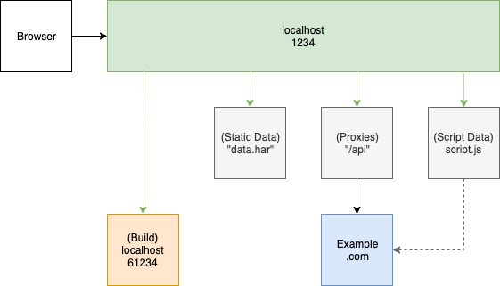
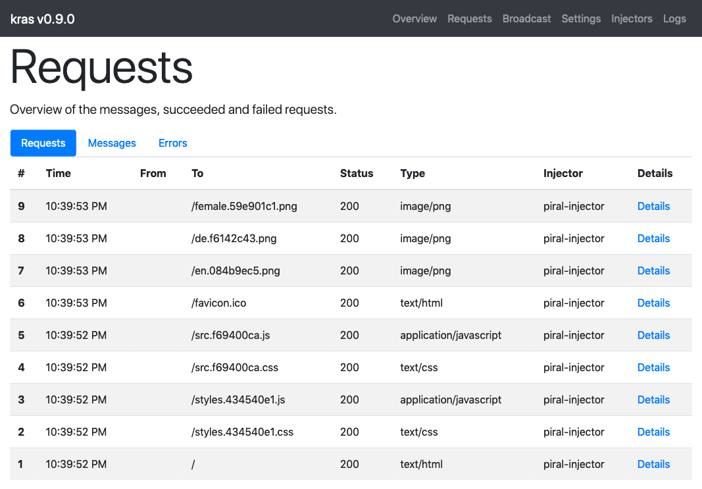

# Mocking the Backend

One of the great things that Piral encourages is offline-first development. Note, however, that this is only encouraged not enforced. What Piral does to make offline-first possible is the integration of [kras](https://github.com/FlorianRappl/kras).

## Video

We also have this tutorial available in form of a video.

@[youtube](https://youtu.be/xTxVoEs2Pn4)

## Introduction to Kras

What kras brings to the table:

- HTTP proxying into an arbitrary environment
- Replying with predefined fixes responses
- Scripted response to HTTP requests

All these capabilities can be used by routing through the development server (usually running at *http://localhost:1234*).



The diagram above illustrates the relationship between the development server, the build server, and the different injectors.

## Mock Server Management

When you start a debugging session you'll end up seeing a message about the mock server management address, usually [http://localhost:1234/manage-mock-server](http://localhost:1234/manage-mock-server). This URL can be used to see what kras has recorded so far and how kras is configured.

The screenshot below shows the kras management website:



The configuration from kras can be either changed on demand (via the management endpoint) or upfront using a *.krasrc* file. More information about the *.krasrc* file can be found in the [kras documentation](https://github.com/FlorianRappl/kras/blob/master/README.md).

We can use the configuration to set up kras in such a way that we enable / configure the three options mentioned above as desired. In the following three sections we'll cover the three options.

## Request Proxying

The request proxying can be set up by a simple mapping, e.g., placing `/posts` to `https://jsonplaceholder.typicode.com/posts` will - if no other injector intercepts the request - forward requests from `http://localhost:1234/posts` to `https://jsonplaceholder.typicode.com/posts`. Likewise, `http://localhost:1234/posts/1` would be forwarded to `https://jsonplaceholder.typicode.com/posts/1`.

The proxy injector is usually the last active injector. Any response of the proxy (e.g., a not found 404) will still lead to a response from this injector. Thus when the proxy injector is active (and captures some request) it is the last used injector.

## Static Request Mocking

Offline-first means that we will potentially not proxy from a local request to an online service. As such using the proxy injector is maybe not a good idea. Luckily, there are a couple of other injectors. Most notably, we have an HAR and a JSON injector. Both are actually based on JSON, however, while HAR is following the popular HAR specification, JSON is following a custom structure.

The advantage of using the HAR injector lies in the capability of doing a real browser recording - then using this source as input for the backend mocking. Alternatively, the advantage of the JSON injector is the simplicity of this format.

Let's use this as an example. We can create a file in the *mocks* folder of a pilet (or the app shell, since kras is also integrated there).

```json
[
  {
    "request": {
      "url": "/posts",
      "target": "",
      "query": {},
      "method": "GET",
      "headers": {},
      "content": ""
    },
    "response": {
      "headers": {},
      "status": {
        "code": 200,
        "text": "OK"
      },
      "url": "/posts",
      "content": "[{\"userId\":1,\"id\":1,\"title\":\"T1\",\"body\":\"B1\"},{\"userId\":1,\"id\":2,\"title\":\"T2\",\"body\":\"B2\"},{\"userId\":1,\"id\":3,\"title\":\"T3\",\"body\":\"T3\"}]"
    }
  }
]
```

The file above could be called "sample.json". It will be picked up automatically; handling every GET request to `/posts` with the provided response.

## Dynamic Request Mocking

The most powerful injector is the so-called "script injector". The script injector allows us to provide a Node.js module that is capable of intercepting requests and (if desired) responding to these requests.

Using the script injector it is possible to dynamically react to requests, e.g., to provide a full emulation of real backend logic.

The example below responds to *every* request with a "hello world"-kind of response.

```js
module.exports = function (ctx, req, res) {
  return res({
    content: `Hello World coming from ${req.url}!`,
  });
};
```

The three parts of the function signature are:

- `ctx` is a global object referring to context settings and allows transporting state
- `req` is the incoming request
- `res` is a helper for building the outgoing response

The function's result needs to be either `undefined` (representing not handled), a response object, or a `Promise` yielding `undefined` or a response object.

The logic of a script injector can be as complex as required - even Node.js modules (either built-in, e.g., `fs` or retrieved via npm, e.g., `request`) can be used.

## Next Steps

In this tutorial we have seen what the integrated proxy can do regarding offline-first development. By using [kras](https://github.com/FlorianRappl/kras) we ensure flexibility without having to modify code to distinguish between production and development.

If you are keen to see how you can improve initial loading performance by introducing server-side rendering, then the next tutorial may be the right one for you.
