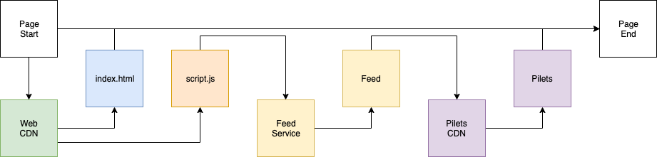
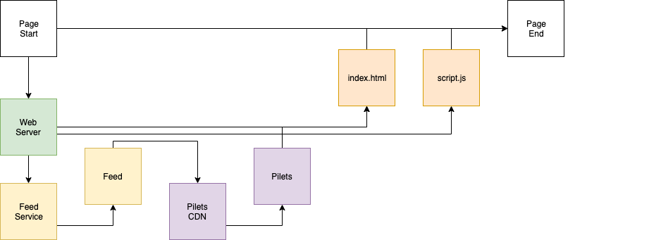
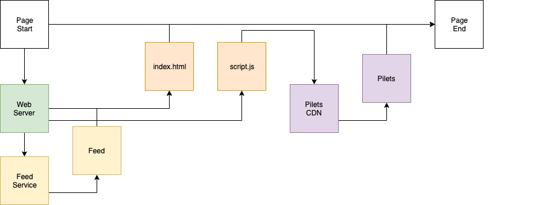

# Server-Side Rendering

Piral makes the development of highly interactive distributed frontend applications quite easy. To enable this Piral uses an approach that focuses on developer experience by allowing using a serverless-first approach. As a consequence, the pilets are retrieves at runtime from a pilet feed service. This approach is also known as client-side rendering (CSR).

Naturally, performance implications apply. While pilets should be cached indefinitely (i.e., they will only require a download if never downloaded or if they have been updated), the responsive from the feed service can never be cached. The additional round-trip time (RTT) to retrieve the pilet feed will add to the JavaScript evaluation and execution time.

For server-side rendering (SSR) the `piral-ssr-utils` package can be quite helpful. It is a small library that comes with two parts. First, it will reduce the RTT by embedding the responsive from the public feed. Second, it can also include (all) the pilets for a request. Consequently, while the page request grows, subsequent requests are essentially eliminated.

## CSR vs SSR

In CSR the client needs to do the work of requesting the info from the feed service, then getting the pilets. All *after* the website with the script has been fully loaded and evaluated.

The diagram below shows this sequence.



In SSR this changes a bit. Now its up to the webserver to do this aggregation. As a side effect we cannot just expose the app shell via some static storage, we actually need a webserver handling the logic.

The diagram below shows this sequence.



**Remark**: The sequence above can be simplified if the pilet feed service is on the same server as the webserver. Likewise, we do not have to provide the full chain, i.e., we could go for a hybrid between the full CSR and the full SSR, e.g., by only including the response from the feed service in the SSR part thus still leaving the pilets for retrieval on the client-side.

## General SSR Setup

In the following paragraphs we assume Node.js with Express to be used for the server part. Generally, the transfer to another framework within the Node.js ecosystem should be straight forward.

While you can separate the client and the server parts in different repositories, it mostly makes sense to have them in the same repository. A possible structure contains three folders, `src/client` for the client entry point, `src/server` for the server entry point, and `src/common` for the shared part.

The client part contains the `index.html` and the referenced root module, which could look as follows:

```jsx
import { hydrate } from 'react-dom';
import { createApp } from '../common/app';

const app = createApp();
hydrate(app, document.querySelector('#app'));
```

The `common/app` module just exports the application as a whole without rendering it. It could be as simple as follows:

```jsx
import * as React from 'react';
import { Piral } from 'piral';
import { createAppInstance } from './instance';

export function createApp() {
  const instance = createAppInstance();
  return <Piral instance={instance} />;
}
```

Everything that deals with the setup of the Piral instance is done in the `createAppInstance` function, which is exported from `common/instance`.

```jsx
import { createInstance } from 'piral-core';
import { configForServerRendering } from 'piral-ssr-utils/runtime';

export function createAppInstance() {
  return createInstance(
    configForServerRendering({
      // your config here
    }),
  );
}
```

We use the `configForServerRendering` helper from `piral-ssr-utils/runtime` to wrap our usual configuration. The wrapper will introduce a custom version of the `requestPilets` function, which already works with SSR, as well as standalone.

Now we only need to define the server part. We start with the following code.

```jsx
import * as express from 'express';
import { readFileSync } from 'fs';
import { resolve } from 'path';

const port = process.env.PORT || 8080;
const outDir = process.env.OUTDIR || resolve(process.cwd(), 'dist');
const app = express();
const indexHtml = readFileSync(resolve(outDir, 'index.html'), 'utf8');

app.get('/', sendIndex);

app.get(
  '*',
  express.static(resolve(outDir), {
    fallthrough: true,
  }),
);

app.get('*', sendIndex);

app.listen(port, () => {
  console.log(`Server running at port ${port}.`);
});
```

We use the output dir as source for static files and the template `index.html`. In any case we fall back to use the index instead of a not found page. The index will be defined in the subsequent sections.

A sample of this setup can be at [smapiot/sample-piral-ssr](https://github.com/smapiot/sample-piral-ssr).

## Embedding the Feed

Sending the index can be implemented as follows. We start with a standard Express middleware definition.

```ts
async function sendIndex(_: express.Request, res: express.Response) {
  const content = '';
  res.send(content);
}
```

We need to render the app from the server. For this we should make use of the previously defined and exported `createApp` function.

```ts
import axios from 'axios';
import { renderFromServer } from 'piral-ssr-utils';
import { createApp } from '../common/app';

const feedUrl = 'https://feed.piral.cloud/api/v1/pilet/sample';

function readRemoteText(link: string) {
  return axios.get(link).then(res => res.data);
}

async function readRemoteJson(link: string) {
  const content = await readRemoteText(link);
  return JSON.parse(content);
}

async function sendIndex(_: express.Request, res: express.Response) {
  const app = createApp();
  const content = await renderFromServer(app, {
    async getPiletsMetadata() {
      const res = await readRemoteJson(feedUrl);
      return res.items;
    },
    fillTemplate(body, script) {
      return indexHtml
        .replace('<div id="app"></div>', `<div id="app">${body}</div>`)
        .replace('<noscript id="data"></noscript>', script);
    },
  });
  res.send(content);
}
```

Filling the template is the most crucial part. Here, we assumed that the `index.html` looks close to:

```html
<!doctype html>
<head><meta charset="utf-8"><title>React SSR Sample</title></head>
<body>
  <div id="app"></div>
  <noscript id="data"></noscript>
  <script src="index.tsx"></script>
</body>
```

The important parts being the `<div id="app"></div>` for the main entry point, and the `<noscript id="data"></noscript>` as a replacement for the embedded data. At this point we have the hybrid that we introduced in the CSR vs SSR section.

The diagram below shows this sequence.



**Remark**: The replacement for the embedded data needs to be placed *before* the root module (in the example above `<script src="index.tsx"></script>`) is referenced.

The embedded data is either the data from the pilet feed (this section) or the data from the feed including the pilets (see next section).

## Embedding the Pilets

Embedding the pilet feed may already be enough to provide improved startup performance. Nevertheless, especially for "cold starts", i.e., where no pilets have yet been seen or loaded, it can make sense to also deliver the pilets with the initial response.

Following the approach described beforehand we can extend the `sendIndex` function to also include the pilets.

The only thing to add is the `getPilet` function in the provided options. This way, we can tell the SSR utility how to retrieve a pilet from its link.

```ts
import axios from 'axios';
import { renderFromServer } from 'piral-ssr-utils';
import { createApp } from '../common/app';

const feedUrl = 'https://feed.piral.cloud/api/v1/pilet/sample';

function readRemoteText(link: string) {
  return axios.get(link).then(res => res.data);
}

async function readRemoteJson(link: string) {
  const content = await readRemoteText(link);
  return JSON.parse(content);
}

async function sendIndex(_: express.Request, res: express.Response) {
  const app = createApp();
  const content = await renderFromServer(app, {
    getPilet(url) {
      return readRemoteText(url);
    },
    async getPiletsMetadata() {
      const res = await readRemoteJson(feedUrl);
      return res.items;
    },
    fillTemplate(body, script) {
      return indexHtml
        .replace('<div id="app"></div>', `<div id="app">${body}</div>`)
        .replace('<noscript id="data"></noscript>', script);
    },
  });
  res.send(content);
}
```

Generally, this approach gives us quite some flexibility. It allows us to use caching in addition to HTTP requests. It also allows us to embed a pilet feed directly on the server-side, potentially not requiring any feed seen outside.

## Conclusion

SSR can be helpful to improve startup performance and user experience. The cost of optimizing the backend is, however, not negligible and should be considered, too. Providing the fastest response possible to pilet feed and general page requests could be already sufficient to ensure a great user experience.

In the next part we will look in more detail at the sharing mechanisms between pilets that offered by Piral.
