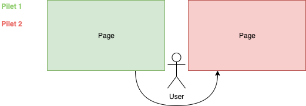
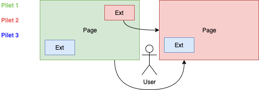

# Sharing Between Pilets

Pilets provide a great way to develop and release business functionality in isolation. However, in the real world we may want to mix functionalities. As such one team should be responsible for a functionality that is shown as a dedicated page, while another team cares about a subfunctionality that may appear on dedicated pages, but also in general or other components.

## Video

We also have this tutorial available in form of a video.

@[youtube](https://youtu.be/EIXtih5_M3M)

## Data

Data from one pilet can be shared with other pilets via the `setData` and `getData` methods of the pilet API. The only thing to know is the name of the data item. It should be as unique as possible as overwriting is not allowed. Thus, the first one writing data will "own" (i.e., have the right to modify) it.

As a best practice the data should be already initialized as soon as possible in the `setup` function.

```ts
export function setup(piral: PiletApi) {
  piral.setData('some-data', undefined);
}
```

One advantage of this approach is that different targets could be defined with a third parameter (not shown in the example above). This parameter contains options for setting an expiration time as well as a target, which could be used by the app shell to, e.g., synchronize with some user data service.

Independent of who owns the data, it can be read from any pilet.

```ts
export function setup(piral: PiletApi) {
  const value = piral.getData('some-data');
  console.log(`Current value is "${value}"!`);
}
```

Sure enough, events keep you covered to be notified in case the data is changed.

```ts
export function setup(piral: PiletApi) {
  piral.on('store-data', ({ name, value }) => {
    if (name === 'some-data') {
      console.log(`New value is "${value}"!`);
    }
  });
}
```

While this can be also (ab)used to build some pilet-internal store (i.e., state container) we recommend abstractions as provided by plugins such as `piral-containers` or `piral-feeds` instead.

## Functions

For functions the same mechanism as for general data applies. Furthermore, since Piral does not restrict access to the DOM global functions could be placed, too, using the `window` context.

```ts
export function setup(piral: PiletApi) {
  window.myFunction = () => {
    console.log('Hello World!');
  };
}
```

Whatever mechanism is used, reading a function should - like reading the data in the previous section - always be done defensively. As such an additional check is necessary.

```ts
export function setup(piral: PiletApi) {
  if (typeof window.myFunction === 'function') {
    window.myFunction();
  }
}
```

While sharing functions is definitely possible, we do not necessarily recommend it for multiple reasons. Usually, you do not want to risk not having the function available. Even worse, it may be available, but different than expected. In any case, sharing only the code may be more what you are after. For these scenarios we recommend publishing the function(s) in a dedicated package, which may be shared via the app shell (i.e., shared dependency) or bundled in the pilets when needed.

Most likely, however, it is not the function you are after, but a functionality coupled to a specific rendering. For these cases we recommend sharing components.

## Components

Piral features a mechanism called "extensions". An extension is a container consisting of components. Extensions essentially boil down to a producer-consumer mechanism.

- **Producers** create components and place them in extension container(s)
- **Consumers** reference components in an extension container by specifying an *extension slot*

Producers and consumers only need to agree on two things for sharing components:

1. A name of the extension container (where the producer(s) place component(s) and the consumer(s) retrieve them)
2. Parameters for the components inside the extension container

The latter will represent the biggest hurdle for the producers.

So how is an extension registered?

```jsx
export function setup(piral: PiletApi) {
  piral.registerExtension('sample-ext-name', params => {
    if (typeof params.value !== 'number') {
      console.warn('You need to provide a param "value" with a <number>.');
      return null;
    }

    return <div>All good!</div>;
  });
}
```

This registers a component in the `sample-ext-name` extension container.

**Note**: We can register multiple extensions for the same container - even within the same pilet.

The example above already provides some parameter checking. Let's see how to use these parameters in a consumer.

```jsx
export function setup(piral: PiletApi) {
  piral.registerPage('/my-page', () => (
    <div>
      <h1>My Example Page</h1>
      <p>Below we use some extension called "sample-ext-name".</p>
      <piral.Extension
        name="sample-ext-name"
        params={{ value: 5 }}
        />
    </div>
  ));
}
```

At the end the `piral.Extension` component marks the extension slot, i.e., the place where the shared components of the respective extension container (referred by the `name` prop) should be rendered. The `params` prop allows us to forward the parameters to the shared components.

**Remark**: The extension (or to be more specific, the shared component) can also be used within the pilet that defines it.

As already mentioned there may be `0`, `1`, or multiple components in the extension container. This can also change over time - the extension slot would then re-render. In the special case of `0` components we can define a fallback that should render. Otherwise, nothing will be shown.

```jsx
export function setup(piral: PiletApi) {
  piral.registerPage('/my-page', () => (
    <div>
      <h1>My Example Page</h1>
      <p>Below we use some extension called "sample-ext-name" with fallback.</p>
      <piral.Extension
        name="sample-ext-name"
        params={{ value: 5 }}
        empty={() => <b>Ouch, nothing yet here!</b>}
        />
    </div>
  ));
}
```

In other cases we may want a special rendering (e.g., only the display the first child). The `render` prop would allow us to do that.

```jsx
export function setup(piral: PiletApi) {
  piral.registerPage('/my-page', () => (
    <div>
      <h1>My Example Page</h1>
      <p>Only the first child (if any) is shown below.</p>
      <piral.Extension
        name="sample-ext-name"
        params={{ value: 5 }}
        render={(children) => children[0]}
        />
    </div>
  ));
}
```

Without these extensions pilets could only share components with the app shell. As a consequence, only page transitions would be possible (among specialized things such as dashboards, modal dialogs, ...).

The following diagram illustrates this.



Using extensions we can finally also share components from pilets to pilets. The mechanism allows to specify what components you want to see displayed. This enables many scenarios, e.g., to render a specific extension always when certain data is available, or to avoid using a link determined by another pilet for linking.

Instead, we can loosely couple to an extension that determines where to link to. The following diagram shows some of these possibilities.



Importantly, the sharing will always be indirect, i.e., the name of the owning pilets will never be mentioned. The name of the extension can be chosen using different principles. In general, it is not possible to make one recommendation - as every naming scheme has its pros and cons. Our only recommendation is to come up with conventions that are related to the problem domain they extension solves.

## Conclusion

Sharing fragments between pilets is a fundamental part of what makes Piral different. In Piral authors of pilets should never think "then I get this particular piece of functionality from *that* pilet", but instead "then I use a piece of functionality provided *if* available".

In the next tutorial we look at how functionality and data can be provided from the Piral instance to the pilets.
