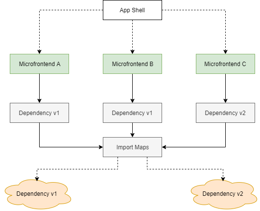

# Sharing Dependencies

Sharing dependencies is one of the selling points of Piral. The key, however, is not to *overshare*, i.e., to share too much. With every shared dependency a certain burden / debt is included. If too many dependencies are shared, the dependency management will become too complicated and eventually collapse.

Our recommendation is to keep the sharing of dependencies from the app shell as practical as possible.

## Implicit Sharing from the App Shell

The easiest way to share dependencies from the app shell is to declare them in the `externals` section of the *package.json*.

For instance, if we want to share the `reactstrap` dependency we can place the following snippet in the app shell's *package.json*:

```json
{
  "pilets": {
    "externals": [
      "reactstrap"
    ],
  },
  // ...
}
```

Besides the dependencies that are specified in the `externals` list of the *package.json* the following dependencies are anyway always added:

- `react`
- `react-dom`
- `react-router`
- `react-router-dom`
- `history`
- `tslib`
- `path-to-regexp`
- `@libre/atom`
- `@dbeining/react-atom`

These are dependencies that are coming directly or indirectly from `piral-core`. Any other dependency needs to be added to the `externals` list above.

## Explicit Sharing from the App Shell

Dependencies can also be "defined" or explicitly mentioned in the app shell. The mechanism for this works via the `getDependencies` option of the `createInstance` function.

```js
const instance = createInstance({
  getDependencies() {
    return {

    };
  },
});
```

**Note**: By default this will override the standard behavior mentioned above. Using this mechanism one can completely define how and which dependencies are shared. To just mimic the original behavior the following code can be used.

```js
const instance = createInstance({
  getDependencies() {
    return getLocalDependencies();
  },
});
```

Using this behavior we can expose "new" dependencies, e.g., the app shell itself.

As an example consider that an app shell named `my-app-shell` also wants to export some functionality coming from a module declared in *exports.ts*. The following code would just do that:

```js
const instance = createInstance({
  getDependencies() {
    return {
      ...getLocalDependencies(),
      'my-app-shell': require('./exports'),
    };
  },
});
```

By default, we do not recommend exporting functionality from the app shell. A Piral instance should **only deliver types** to the pilets. However, sometimes having a dedicated package for extra functionality would either complicate things or is just not feasible.

## Type Declarations

While the explicit way is great for flexibility it comes with one caveat: For this kind of sharing types are not automatically inferred and generated. As a result, we need to place additional typings for our offerings.

By specifying the `typings` field in the *package.json* of the Piral instance we can tell Piral where the *.d.ts* files describing our app shell exports are placed.

As an example, for referencing a file called *api.d.ts*, which is adjacent to the *package.json* we would thus use the following snippet:

```json
{
  "typings": "api.d.ts",
  // ...
}
```

The file could look as simple as:

```ts
export declare function myfunction(): void;
```

This would tell pilets that an import of `myfunction` is possible.

Using this technique we can also describe other modules that we've added. For instance, explicitly stating the module name of our app shell:

```ts
declare module 'my-app-shell' {
  export declare function myfunction(): void;
}
```

**Important**: These are just type declarations. We could, of course, declare some module like `foo-bar`, however, if that is indeed used in a pilet the build will potentially fail. As long as no module with the given name really exists the bundler will not be able to resolve it - independent of what TypeScript assumes.

The rule of thumb for sharing the type declarations is: Everything exported top-level will be associated with the app shell, everything exported from an explicitly declared module will be associated with that module.

## Sharing from Pilets

The mechanism to share dependencies used in pilets is called "import maps". Import maps are also on the way to become [an official standard](https://wicg.github.io/import-maps/).

Since Piral uses Parcel as bundler we rely on the Parcel plugin `parcel-plugin-import-maps`.

The diagram below shows how this works. Every pilet that uses import maps talks to a central location that is not managed by the Piral instance. The central location manages the dependencies such that if a dependency was already requested, it will not load it again. Otherwise, it will load the different resources.



That way you can safely use multiple versions of your dependencies. If you consolidate them you'll get a performance improvement. Otherwise, you'll get the performance penalty as usual, however, you gained the flexibility to independently choose your version.

The effort to actually use import maps is quite low. The first step is to declare potentially shared dependencies via the pilet's *package.json*:

```json
{
  "name": "my-pilet",
  "version": "1.0.0",
  "importmap": {
    "imports": {
      "lodash": "./node_modules/lodash/index.js"
    }
  }
}
```

Independent of you reference the shared dependency from a local installation or remotely (via a URL usually pointing to a CDN) you should have installed the dependency locally (as a dev dependency). In the example before this would have required:

```sh
npm i lodash --save-dev
```

The next step is to introduce a loader wrapper. Since import maps are loaded asynchronously we need to wait until these are ready.

```ts
// index.ts
module.exports = require('importmap').ready().then(() => require('./root'));
```

where `root` refers to the usual pilet root module, e.g.,

```ts
// root.tsx
import * as React from 'react';
import { PiletApi } from 'my-app-shell';

const MyPage = React.lazy(() => import('./MyPage'));

export function setup(app: PiletApi) {
  app.registerPage('/sample', MyPage);
}
```

At this point you can use the shared resource (like any other dependency) in your code.

```jsx
// MyPage.tsx
import * as React from 'react';
import { partition } from 'lodash';

const partitions = partition([1, 2, 3, 4], n => n % 2);

export default () => (
  <div>
    <h1>Hello</h1>
    <ul>
      {partitions.map((p, i) => <li key={i}>Partition {i + 1} with {p.length} elements</li>)}
    </ul>
  </div>
);
```

The showcased use of `ready` works in all cases, however, sometimes you may want to delay loading until you actually need a resource. In these situations it makes sense to use another variant of `ready`, which gets a single parameter as input data. If the parameter is a single string, it is interpreted as the package to look for. Alternatively, an array of package names can be passed in, too.

## Conclusion

Sharing dependencies in Piral is an important aspect that can be controlled in simple ways. Piral understands itself here as a guide and tool. Sharing all dependencies is certainly not helpful and should be avoided. On the other hand sharing no dependency will in most cases not be beneficial, too. Finding a good "middle" way will take time.

The most effective sharing comes by extending the Pilet API. One crucial aspect is that some sharing will be centralized in Piral's state container. In the next tutorial you'll learn how to use Piral's state container with (custom) actions.
