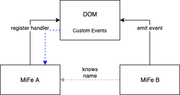

# Events

As already seen there are multiple ways to establish communication between pilets. The crucial point is "what's the purpose of the communication". If all we want is to distribute a piece of information to anyone listening *right now* then an *event* may be the right thing.

Wikipedia defines the term such that ...

> [...] an event is an action or occurrence recognized by software, often originating asynchronously from the external environment, that may be handled by the software.

If we need the information to be available also for future use (i.e., even to interested parties that are not listening right now) then the data store is a better option. UI fragments are best shared via the extension mechanism.

## Video

We also have this tutorial available in form of a video.

@[youtube](https://youtu.be/dWVz0lOGIoI)

## Basic Support

The essential support that is brought already from `piral-core` consists of three API functions:

- `on` to subscribe to an event
- `off` to unsubscribe from an event
- `emit` to publish an event

The Piral instance and all pilets can use these three functions to distribute and receive messages.

For instance, one pilet could have code in its root module that looks like this:

```js
export function setup(app) {
  app.on('my-event', data => {
    console.log('Received data...', data);
  });
}
```

Another pilet could be written as follows:

```js
export function setup(app) {
  setTimeout(() => {
    app.emit('my-event', {
      message: 'Hello after 5 seconds!',
    });
  }, 5000);
}
```

If both pilets are loaded we should see an output in the console of our browser after 5 seconds.

**Remark**: The object used as second argument of `emit` is called the event args. This argument is passed on as-is. We recommend only passing on objects, as they are extensible and could be extended in the future without breaking on consumers.

## Known vs Unknown Events

The event mechanism in Piral is quite flexible and works with *any* name and *any* argument. While this is very dynamic indeed, it also leaves room for error due to typos or wrong assumptions.

Ideally, the events are all known by every participant and can thus be hard coded via a TypeScript definition. Piral supports this from the app shell.

Let's assume you want to declare a new `hello` event that gives us a `message` field in its event args.

```ts
declare module 'piral-core/lib/types/custom' {
  interface PiralCustomEventMap {
    hello: PiralHelloEvent;
  }
}

export interface PiralHelloEvent {
  message: string;
}
```

Using the `hello` event anywhere will give full completion on the event args, which reveals a single field `message` of type `string`. The `hello` event has therefore become a "known" event. All names that are not declared via the event map "unknown". Their type is implicitly referred to as `any`.

## Under the Hood

The event implementation in Piral is lightweight and fast. Underneath we use custom events to leverage the browser's native way of distributing events quickly and reliable.

We do not serialize the event args. Therefore, you are able to also transparent functions (e.g., callbacks) or compare object references.



While it could be possible to fake Piral events in practice it would be very hard to do. Under the hood Piral makes sure that the Piral events are properly packaged in a wrapper when being transported via a DOM custom event. The wrapper contains a special signature that is checked before distributing.

## Conclusion

Events are a great way to distribute information quickly among multiple subscribers. The Piral instance can also leverage events to inform pilets about certain changes.

In the next tutorial we'll have a look on how to easily integrate authentication in Piral.
