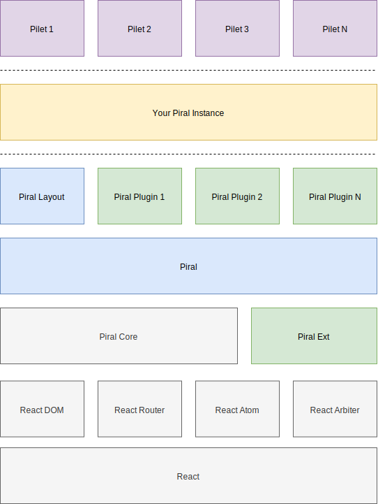

# Core and Base

Piral is shipped in individual npm packages. While packages such as the `piral-cli` or `piral` can be used standalone, others exist purely as libraries to add additional functionality or form the basis for some specific behavior.

Following this guideline you will most likely have chosen `piral` as your most fundamental package. For us, `piral` is in the framework category of packages.

## Piral Framework Packages

The core Piral framework is represented by self-closed packages such as `siteless`, `piral`, or `piral-native`. These packages bring everything with them to be run without any other dependencies. They are also opinionated, i.e., they come with some dependencies (or versions of dependencies) that you may disagree with.

Taking `piral` as the framework of choice we can draw the following package hierarchy diagram.



As you can see the `piral` package is placed on top of `piral-core` and `piral-ext`. While the latter delivers a "standardized" (i.e., opinionated) set of plugins, the former brings the main functionalities that define Piral.

`piral-core` is a real library. It does come with some dependencies, but most dependencies are actually defined as peer dependencies. One of these peer dependencies is `react`. This mechanism allows applications with specific demands for the version of `react` to actually choose that version instead of whatever version `piral` uses.

Additionally, `piral-core` extends the pilet API defined in `piral-base` with component APIs (`registerPage` and `registerExtension`). Even though `piral-core` uses (or is based on) React it does not want to be restricted to it. Instead, `piral-core` only uses React to gain a great component model, provide a routing mechanism, and allow arbitrary frameworks to work.

Like `piral-core`, `piral-base` is also a real library. However, while `piral-core` uses a specific framework (React), `piral-base` does not come with any UI support. Insead, is a dependency-free library that only takes care of providing the basic models (e.g., the pilet API) and loading the pilets. It contains the essential loading strategies and ways to override or extend loading of all or individual pilets.

## Migrating from Piral to Piral Core

`piral-core` should be used if a fully fledged microfrontend solution is expected without being too opinionated with respect to its exposed API or the versions of `react`, `react-dom`, `react-router` etc. packages. It makes sense, for instance, for larger applications that come with already with a lot of restrictions and use cases in mind. It also is the right choice when an existing project should be migrated to Piral.

Quite often the scenario is that somebody starts with `piral` but then realized that one or the other plugin should not be included. Sometimes further flexibility, e.g., regarding the chosen package versions is demanded. In any of these cases a migration from `piral` to `piral-core` makes sense. What should be done then?

Well, first we need to resolve some peer dependencies, that automatically came with `piral`:

- `react`,
- `react-dom`,
- `react-router`, and
- `react-router-dom`

Any version that supports hooks should do it.

As the second step we should think about polyfills. If `piral/polyfills` has been used beforehand we may want to replicate that. This one uses the following modules:

- `regenerator-runtime/runtime`

Depending on the target platform / browser only a few (or actually none) of these are required.

Next, we need to think about which plugins from `piral-ext` should still be used. If all the plugins / pilet API of `piral` should be used / preserved, the easiest is to install `piral-ext`. However, getting a bit more individual we may want to explicitly install and use only a subset of the following plugins:

- `piral-dashboard`,
- `piral-feeds`,
- `piral-menu`,
- `piral-modals`,
- `piral-notifications`, and
- `piral-translate`

All in all `piral-core` may be the right compromise between individualism and convenience. Even more freedom is then given by choosing `piral-base`.

## Using Piral Base

`piral-base` should be used if the pilet API needs to be fully customized or specialized. It makes sense, for instance, when the architecture behind Piral is interesting, but React should not be used at all. But even with React it may make sense considering the Pilet API should be totally different or things such as extensions should be reimplemented.

The Pilet API surface that comes with `piral-base` is super minimal:

```ts
interface PiletApi {
  /**
   * Gets the metadata of the current pilet.
   */
  meta: PiletMetadata;
  /**
   * Attaches a new event listener.
   * @param type The type of the event to listen for.
   * @param callback The callback to trigger.
   */
  on<K extends keyof PiralEventMap>(type: K, callback: Listener<PiralEventMap[K]>): PiletApi;
  /**
   * Detaches an existing event listener.
   * @param type The type of the event to listen for.
   * @param callback The callback to trigger.
   */
  off<K extends keyof PiralEventMap>(type: K, callback: Listener<PiralEventMap[K]>): PiletApi;
  /**
   * Emits a new event with the given type.
   * @param type The type of the event to emit.
   * @param arg The payload of the event.
   */
  emit<K extends keyof PiralEventMap>(type: K, arg: PiralEventMap[K]): PiletApi;
}
```

Essentially, this means that only the pilet's metadata and the standard eventing system for loose communication is available.

With this in mind we can build our own microfrontend solution, still profiting from the Piral CLI and its essential architecture, principles, and ideas. At its core the `startLoadingPilets` function should be used.

As an example let's consider the following `App` component, using exactly this:

```js
const App = () => {
  const [state, setState] = React.useState({
    loaded: false,
    error: undefined,
    pilets: [],
  });

  React.useEffect(() => {
    const { connect, disconnect } = startLoadingPilets(options);
    const notifier = (error, pilets, loaded) => {
      setState(!loaded, error, pilets);
    };
    connect(notifier);
    return () => disconnect(notifier);
  }, []);

  return (
    loaded ? <AppLayout pilets={state.pilets} error={error} /> : <LoadingSpinner />
  );
};
```

Now `AppLayout` could be defined to be exactly an app shell layout like you've been used to from `piral` and `piral-core`. Alternatively, you can build up a completely different model if you like to.

## Conclusion

Depending on your application it makes sense to use `piral-core` or even `piral-base`. While `piral` is fully opinionated, the lower-level packages don't come with batteries included. Nevertheless, the modular layout of Piral makes it possible to get everything just in as you need - and want - to.

In the next tutorial, we'll look at how to set up a monorepo for your microfrontends with Piral.
